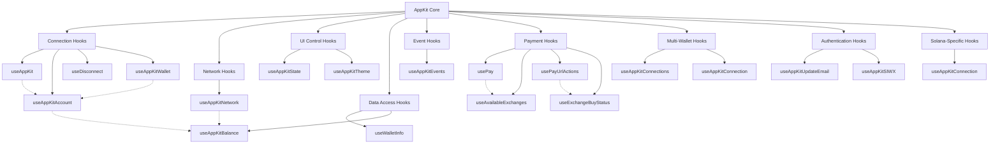

# Installation

AppKit provides seamless integration with multiple blockchain ecosystems. . It supports [Wagmi](https://wagmi.sh/) and [Ethers v6](https://docs.ethers.org/v6/) on Ethereum,
[@solana/web3.js](https://solana-labs.github.io/solana-web3.js/) on Solana, as well as Bitcoin, TON and other networks. AppKit Core with Universal Provider library, enable compatibility across any blockchain protocol.

<Note>
  These steps are specific to [Next.js](https://nextjs.org/) app router. For other React frameworks
  read the [React documentation](../../react/core/installation).
</Note>

## Installation

**If you prefer referring to a video tutorial for this, please [click here](#video-tutorial).**

**Setting up from scratch? → Try out the [AppKit CLI templates](#alternative-installation) or the [AI-assisted setup](#alternative-installation).**

## Custom Installation

<Tabs>
  <Tab title="Wagmi">
    <CodeGroup>
      ```bash npm theme={null}
      npm install @reown/appkit @reown/appkit-adapter-wagmi wagmi viem @tanstack/react-query
      ```

      ```bash Yarn theme={null}
      yarn add @reown/appkit @reown/appkit-adapter-wagmi wagmi viem @tanstack/react-query
      ```

      ```bash Bun theme={null}
      bun add @reown/appkit @reown/appkit-adapter-wagmi wagmi viem @tanstack/react-query
      ```

      ```bash pnpm theme={null}
      pnpm add @reown/appkit @reown/appkit-adapter-wagmi wagmi viem @tanstack/react-query
      ```
    </CodeGroup>

  </Tab>

  <Tab title="Ethers v5">
    <CodeGroup>
      ```bash npm theme={null}
      npm install @reown/appkit @reown/appkit-adapter-ethers5 ethers@5.7.2
      ```

      ```bash Yarn theme={null}
      yarn add @reown/appkit @reown/appkit-adapter-ethers5 ethers@5.7.2
      ```

      ```bash Bun theme={null}
      bun add @reown/appkit @reown/appkit-adapter-ethers5 ethers@5.7.2
      ```

      ```bash pnpm theme={null}
      pnpm add @reown/appkit @reown/appkit-adapter-ethers5 ethers@5.7.2
      ```
    </CodeGroup>

  </Tab>

  <Tab title="Ethers">
    <CodeGroup>
      ```bash npm theme={null}
      npm install @reown/appkit @reown/appkit-adapter-ethers ethers
      ```

      ```bash Yarn theme={null}
      yarn add @reown/appkit @reown/appkit-adapter-ethers ethers
      ```

      ```bash Bun theme={null}
      bun add @reown/appkit @reown/appkit-adapter-ethers ethers
      ```

      ```bash pnpm theme={null}
      pnpm add @reown/appkit @reown/appkit-adapter-ethers ethers
      ```
    </CodeGroup>

  </Tab>

  <Tab title="Solana">
    <CodeGroup>
      ```bash npm theme={null}
      npm install @reown/appkit @reown/appkit-adapter-solana
      ```

      ```bash Yarn theme={null}
      yarn add @reown/appkit @reown/appkit-adapter-solana
      ```

      ```bash Bun theme={null}
      bun add @reown/appkit @reown/appkit-adapter-solana
      ```

      ```bash pnpm theme={null}
      pnpm add @reown/appkit @reown/appkit-adapter-solana
      ```
    </CodeGroup>

  </Tab>

  <Tab title="Bitcoin">
    <CodeGroup>
      ```bash npm theme={null}
      npm install @reown/appkit @reown/appkit-adapter-bitcoin
      ```

      ```bash Yarn theme={null}
      yarn add @reown/appkit @reown/appkit-adapter-bitcoin
      ```

      ```bash Bun theme={null}
      bun add @reown/appkit @reown/appkit-adapter-bitcoin
      ```

      ```bash pnpm theme={null}
      pnpm add @reown/appkit @reown/appkit-adapter-bitcoin
      ```
    </CodeGroup>

  </Tab>

  <Tab title="TON">
    <CodeGroup>
      ```bash npm theme={null}
      npm install @reown/appkit @reown/appkit-adapter-ton
      ```

      ```bash Yarn theme={null}
      yarn add @reown/appkit @reown/appkit-adapter-ton
      ```

      ```bash Bun theme={null}
      bun add @reown/appkit @reown/appkit-adapter-ton
      ```

      ```bash pnpm theme={null}
      pnpm add @reown/appkit @reown/appkit-adapter-ton
      ```
    </CodeGroup>

  </Tab>

  <Tab title="Others networks (AppKit Core)">
    <CodeGroup>
      ```bash npm theme={null}
      npm install @reown/appkit @reown/appkit-universal-connector @reown/appkit-common ethers
      ```

      ```bash Yarn theme={null}
      yarn add @reown/appkit @reown/appkit-universal-connector @reown/appkit-common ethers
      ```

      ```bash Bun theme={null}
      bun add @reown/appkit @reown/appkit-universal-connector @reown/appkit-common ethers
      ```

      ```bash pnpm theme={null}
      pnpm add @reown/appkit @reown/appkit-universal-connector @reown/appkit-common ethers
      ```
    </CodeGroup>

  </Tab>
</Tabs>

## Cloud Configuration

Create a new project on [Reown Dashboard](https://dashboard.reown.com) and obtain a new project ID.

<Card title="Don't have a project ID?" icon="circle-info" href="https://dashboard.reown.com/?utm_source=cloud_banner&utm_medium=docs&utm_campaign=backlinks">
  Head over to Reown Dashboard and create a new project.
</Card>

## Implementation

<Tabs>
  <Tab title="Wagmi">
    <Card title="wagmi Example" icon="github" href="https://github.com/reown-com/appkit-web-examples/tree/main/nextjs/next-wagmi-app-router">
      Check the Next wagmi example
    </Card>

    For a quick integration, you can use the `createAppKit` function with a unified configuration. This automatically applies the predefined configurations for different adapters like Wagmi, Ethers, or Solana, so you no longer need to manually configure each one individually. Simply pass the common parameters such as projectId, chains, metadata, etc., and the function will handle the adapter-specific configurations under the hood.

    This includes WalletConnect, Coinbase and Injected connectors, and the [Blockchain API](../../../../cloud/blockchain-api) as a [transport](https://wagmi.sh/core/api/createConfig#transports)

    ### Wagmi config

    Create a new file for your Wagmi configuration, since we are going to be calling this function on the client and the server it cannot live inside a file with the 'use client' directive.

    For this example we will create a file called `config/index.tsx` outside our app directory and set up the following configuration

    ```tsx  theme={null}
    import { cookieStorage, createStorage, http } from '@wagmi/core'
    import { WagmiAdapter } from '@reown/appkit-adapter-wagmi'
    import { mainnet, arbitrum } from '@reown/appkit/networks'

    // Get projectId from https://dashboard.reown.com
    export const projectId = process.env.NEXT_PUBLIC_PROJECT_ID

    if (!projectId) {
      throw new Error('Project ID is not defined')
    }

    export const networks = [mainnet, arbitrum]

    //Set up the Wagmi Adapter (Config)
    export const wagmiAdapter = new WagmiAdapter({
      storage: createStorage({
        storage: cookieStorage
      }),
      ssr: true,
      projectId,
      networks
    })

    export const config = wagmiAdapter.wagmiConfig
    ```

    ## Importing networks

    Reown AppKit use [Viem](https://viem.sh/) networks under the hood, which provide a wide variety of networks for EVM chains. You can find all the networks supported by Viem within the `@reown/appkit/networks` path.

    ```js {2} theme={null}
    import { createAppKit } from '@reown/appkit'
    import { mainnet, arbitrum, base, scroll, polygon } from '@reown/appkit/networks'
    ```

    <Note>
      Looking to add a custom network? Check out the [custom
      networks](/appkit/next/core/custom-networks) section.
    </Note>

    ## SSR and Hydration

    * Using cookies is completely optional and by default Wagmi will use `localStorage` instead if the `storage` param is not defined.
    * The `ssr` flag will delay the hydration of Wagmi's store to avoid hydration mismatch errors.
    * AppKit doesn't fully support the `ssr` flag.

    ### Context Provider

    Let's create now a context provider that will wrap our application and initialized AppKit (`createAppKit` needs to be called inside a Next Client Component file).

    In this example we will create a file called `context/index.tsx` outside our app directory and set up the following configuration

    ```tsx  theme={null}
    'use client'

    import { wagmiAdapter, projectId } from '@/config'
    import { QueryClient, QueryClientProvider } from '@tanstack/react-query'
    import { createAppKit } from '@reown/appkit/react'
    import { mainnet, arbitrum } from '@reown/appkit/networks'
    import React, { type ReactNode } from 'react'
    import { cookieToInitialState, WagmiProvider, type Config } from 'wagmi'

    // Set up queryClient
    const queryClient = new QueryClient()

    if (!projectId) {
      throw new Error('Project ID is not defined')
    }

    // Set up metadata
    const metadata = {
      name: 'appkit-example',
      description: 'AppKit Example',
      url: 'https://appkitexampleapp.com', // origin must match your domain & subdomain
      icons: ['https://avatars.githubusercontent.com/u/179229932']
    }

    // Create the modal
    const modal = createAppKit({
      adapters: [wagmiAdapter],
      projectId,
      networks: [mainnet, arbitrum],
      defaultNetwork: mainnet,
      metadata: metadata,
      features: {
        analytics: true // Optional - defaults to your Cloud configuration
      }
    })

    function ContextProvider({ children, cookies }: { children: ReactNode; cookies: string | null }) {
      const initialState = cookieToInitialState(wagmiAdapter.wagmiConfig as Config, cookies)

      return (
        <WagmiProvider config={wagmiAdapter.wagmiConfig as Config} initialState={initialState}>
          <QueryClientProvider client={queryClient}>{children}</QueryClientProvider>
        </WagmiProvider>
      )
    }

    export default ContextProvider
    ```

    ### Layout

    Next, in our `app/layout.tsx` file, we will import our `ContextProvider` component and call [the Wagmi's function `cookieToInitialState`.](https://wagmi.sh/react/guides/ssr#_2-hydrate-the-cookie)

    The `initialState` returned by `cookieToInitialState`, contains the optimistic values that will populate the Wagmi's store both on the server and client.

    ```tsx  theme={null}
    import type { Metadata } from 'next'
    import { Inter } from 'next/font/google'
    import './globals.css'

    const inter = Inter({ subsets: ['latin'] })

    import { headers } from 'next/headers' // added
    import ContextProvider from '@/context'

    export const metadata: Metadata = {
      title: 'AppKit Example App',
      description: 'Powered by Reown'
    }

    export default async function RootLayout({
      children
    }: Readonly<{
      children: React.ReactNode
    }>) {
      const headersObj = await headers()
      const cookies = headersObj.get('cookie')

      return (
        <html lang="en">
          <body className={inter.className}>
            <ContextProvider cookies={cookies}>{children}</ContextProvider>
          </body>
        </html>
      )
    }
    ```

  </Tab>

  <Tab title="Ethers v5">
    In this example we will create a new file called `context/appkit.tsx` outside our app directory and set up the following configuration

    ```tsx  theme={null}
    "use client";

    import { createAppKit } from "@reown/appkit/react";
    import { Ethers5Adapter } from "@reown/appkit-adapter-ethers5";
    import { mainnet, arbitrum } from "@reown/appkit/networks";

    // 1. Get projectId at https://dashboard.reown.com
    const projectId = "YOUR_PROJECT_ID";

    // 2. Create a metadata object
    const metadata = {
      name: "My Website",
      description: "My Website description",
      url: "https://mywebsite.com", // origin must match your domain & subdomain
      icons: ["https://avatars.mywebsite.com/"],
    };

    // 3. Create the AppKit instance
    createAppKit({
      adapters: [new Ethers5Adapter()],
      metadata: metadata,
      networks: [mainnet, arbitrum],
      projectId,
      features: {
        analytics: true, // Optional - defaults to your Cloud configuration
      },
    });

    export function AppKit() {
      return (
        <YourApp /> //make sure you have configured the <appkit-button> inside
      );
    }
    ```

    Next, in your `app/layout.tsx` or `app/layout.jsx` file, import the custom AppKit component.

    ```tsx  theme={null}
    import "./globals.css";

    import { AppKit } from "../context/appkit";

    export const metadata = {
      title: "AppKit",
      description: "AppKit Example",
    };

    export default function RootLayout({ children }) {
      return (
        <html lang="en">
          <body>
            <AppKit>{children}</AppKit>
          </body>
        </html>
      );
    }
    ```

    <Warning>
      Make sure that the `url` from the `metadata` matches your domain and subdomain. This will later be used by the **Verify API** to tell wallets if your application has been verified or not.
    </Warning>

  </Tab>

  <Tab title="Ethers">
    <Card title="ethers Example" icon="github" href="https://github.com/reown-com/appkit-web-examples/tree/main/nextjs/next-ethers-app-router">
      Check the Next ethers example
    </Card>

    In this example we will create a new file called `context/appkit.tsx` outside our app directory and set up the following configuration

    ```tsx  theme={null}
    "use client";

    import { createAppKit } from "@reown/appkit/react";
    import { EthersAdapter } from "@reown/appkit-adapter-ethers";
    import { mainnet, arbitrum } from "@reown/appkit/networks";

    // 1. Get projectId at https://dashboard.reown.com
    const projectId = "YOUR_PROJECT_ID";

    // 2. Create a metadata object
    const metadata = {
      name: "My Website",
      description: "My Website description",
      url: "https://mywebsite.com", // origin must match your domain & subdomain
      icons: ["https://avatars.mywebsite.com/"],
    };

    // 3. Create the AppKit instance
    createAppKit({
      adapters: [new EthersAdapter()],
      metadata,
      networks: [mainnet, arbitrum],
      projectId,
      features: {
        analytics: true, // Optional - defaults to your Cloud configuration
      },
    });

    export function AppKit() {
      return (
        <YourApp /> //make sure you have configured the <appkit-button> inside
      );
    }
    ```

    Next, in your `app/layout.tsx` or `app/layout.jsx` file, import the custom AppKit component.

    ```tsx  theme={null}
    import "./globals.css";

    import { AppKit } from "../context/appkit";

    export const metadata = {
      title: "AppKit",
      description: "AppKit Example",
    };

    export default function RootLayout({ children }) {
      return (
        <html lang="en">
          <body>
            <AppKit>{children}</AppKit>
          </body>
        </html>
      );
    }
    ```

    <Warning>
      Make sure that the `url` from the `metadata` matches your domain and subdomain. This will later be used by the **Verify API** to tell wallets if your application has been verified or not.
    </Warning>

  </Tab>

  <Tab title="Solana">
    <Card title="Solana Example" icon="github" href="https://github.com/reown-com/appkit-web-examples/tree/main/nextjs/next-solana-app-router">
      Check the Next Solana example
    </Card>

    AppKit Solana provides a set of React components and hooks to easily connect Solana wallets with your application.

    On top of your app set up the following configuration, making sure that all functions are called outside any React component to avoid unwanted rerenders.

    ```tsx  theme={null}
    // App.tsx
    import { createAppKit } from "@reown/appkit/react";
    import { SolanaAdapter } from "@reown/appkit-adapter-solana/react";
    import { solana, solanaTestnet, solanaDevnet } from "@reown/appkit/networks";

    // 0. Set up Solana Adapter
    const solanaWeb3JsAdapter = new SolanaAdapter();

    // 1. Get projectId from https://dashboard.reown.com
    const projectId = "YOUR_PROJECT_ID";

    // 2. Create a metadata object - optional
    const metadata = {
      name: "AppKit",
      description: "AppKit Solana Example",
      url: "https://example.com", // origin must match your domain & subdomain
      icons: ["https://avatars.githubusercontent.com/u/179229932"],
    };

    // 3. Create modal
    createAppKit({
      adapters: [solanaWeb3JsAdapter],
      networks: [solana, solanaTestnet, solanaDevnet],
      metadata: metadata,
      projectId,
      features: {
        analytics: true, // Optional - defaults to your Cloud configuration
      },
    });

    export default function App() {
      return <YourApp />;
    }
    ```

  </Tab>

  <Tab title="Bitcoin">
    <Card title="Bitcoin Example" icon="github" href="https://github.com/reown-com/appkit-web-examples/tree/main/nextjs/next-bitcoin-app-router">
      Check the Next Bitcoin example
    </Card>

    AppKit Bitcoin provides a set of React components and hooks to easily connect Bitcoin wallets with your application.

    On top of your app set up the following configuration, making sure that all functions are called outside any React component to avoid unwanted rerenders.

    ```tsx  theme={null}
    // App.tsx
    import { createAppKit } from '@reown/appkit/react'
    import { BitcoinAdapter } from '@reown/appkit-adapter-bitcoin'
    import { bitcoin, bitcoinTestnet, bitcoinSignet } from '@reown/appkit/networks'

    // 1. Get projectId from https://dashboard.reown.com
    const projectId = 'YOUR_PROJECT_ID'

    // 2. Set the networks
    const networks = [bitcoin, bitcoinTestnet, bitcoinSignet]

    // 3. Set up Bitcoin Adapter
    const bitcoinAdapter = new BitcoinAdapter({
      projectId
    })

    // 4. Create a metadata object - optional
    const metadata = {
      name: 'AppKit',
      description: 'AppKit Bitcoin Example',
      url: 'https://example.com', // origin must match your domain & subdomain
      icons: ['https://avatars.githubusercontent.com/u/179229932']
    }

    // 5. Create modal
    createAppKit({
      adapters: [bitcoinAdapter],
      networks,
      metadata,
      projectId,
      features: {
        analytics: true // Optional - defaults to your Cloud configuration,
        email: false,
        socials: []
      }
    })

    export default function App() {
      return <YourApp />
    }
    ```

    ## Bitcoin Provider Interface

    ```ts  theme={null}
    export interface BitcoinConnector extends ChainAdapterConnector, Provider {
      getAccountAddresses(): Promise<BitcoinConnector.AccountAddress[]>;
      signMessage(params: BitcoinConnector.SignMessageParams): Promise<string>;
      sendTransfer(params: BitcoinConnector.SendTransferParams): Promise<string>;
      signPSBT(
        params: BitcoinConnector.SignPSBTParams
      ): Promise<BitcoinConnector.SignPSBTResponse>;
    }
    ```

    ### Parameters

    <Tabs>
      <Tab title="SignMessageParams">
        ```ts  theme={null}
          export type SignMessageParams = {
            /**
             * The message to be signed
             */
            message: string
            /**
             * The address to sign the message with
             */
            address: string
          }
        ```
      </Tab>

      <Tab title="SendTransferParams">
        ```ts  theme={null}
          export type SendTransferParams = {
            /**
             * The amount to be sent in satoshis
             */
            amount: string
            /**
             * The address to send the transfer to
             */
            recipient: string
          }
        ```
      </Tab>

      <Tab title="SignPSBTParams">
        ```ts  theme={null}
          export type SignPSBTParams = {
            /**
             * The PSBT to be signed, string base64 encoded
             */
            psbt: string
            signInputs: {
              /**
               * The address whose private key to use for signing.
               */
              address: string
              /**
               * Specifies which input to sign
               */
              index: number
              /**
               * Specifies which part(s) of the transaction the signature commits to
               */
              sighashTypes: number[]
            }[]

            /**
             * If `true`, the PSBT will be broadcasted after signing. Default is `false`.
             */
            broadcast?: boolean

        }

        ```
      </Tab>
    </Tabs>

    ### Responses

    <Tabs>
      <Tab title="AccountAddress">
        ```ts  theme={null}
          export type AccountAddress = {
            /**
             * Public address belonging to the account.
             */
            address: string
            /**
             * Public key for the derivation path in hex, without 0x prefix
             */
            publicKey?: string
            /**
             * The derivation path of the address e.g. "m/84'/0'/0'/0/0"
             */
            path?: string
            /**
             * The purpose of the address
             */
            purpose: 'payment' | 'ordinal' | 'stx'
          }
        ```
      </Tab>

      <Tab title="SignPSBTResponse">
        ```ts  theme={null}
          export type SignPSBTResponse = {
            /**
             * The signed PSBT, string base64 encoded
             */
            psbt: string
            /**
             * The `string` transaction id of the broadcasted transaction or `undefined` if not broadcasted
             */
            txid?: string
          }
        ```
      </Tab>
    </Tabs>

  </Tab>

  <Tab title="TON">
    <Card title="TON Example" icon="github" href="https://github.com/reown-com/appkit-web-examples/tree/main/nextjs/next-ton-app-router">
      Check the Next TON example
    </Card>

    AppKit TON provides a set of React components and hooks to easily connect TON wallets with your application.

    On top of your app set up the following configuration, making sure that all functions are called outside any React component to avoid unwanted rerenders.

    ```tsx  theme={null}
    // App.tsx
    import { createAppKit } from '@reown/appkit/react'
    import { TonAdapter } from '@reown/appkit-adapter-ton'
    import { ton, tonTestnet } from '@reown/appkit/networks'

    // 1. Get projectId from https://dashboard.reown.com
    const projectId = 'YOUR_PROJECT_ID'

    // 2. Set the networks
    const networks = [ton, tonTestnet]

    // 3. Set up TON Adapter
    const tonAdapter = new TonAdapter({
      projectId
    })

    // 4. Create a metadata object - optional
    const metadata = {
      name: 'AppKit',
      description: 'AppKit TON Example',
      url: 'https://example.com', // origin must match your domain & subdomain
      icons: ['https://avatars.githubusercontent.com/u/179229932']
    }

    // 5. Create modal
    createAppKit({
      adapters: [tonAdapter],
      networks,
      metadata,
      projectId,
      features: {
        analytics: true // Optional - defaults to your Cloud configuration,
        email: false,
        socials: []
      }
    })

    export default function App() {
      return <YourApp />
    }
    ```

  </Tab>

  <Tab title="Others networks (AppKit Core)">
    For a quick integration of Appkit Core you can use the `UniversalConnector` class. Which simplifies the integration of Appkit Core by providing a single interface for all the blockchain protocols.

    You can configure the Universal Connector with the networks you want to support.
    For more information, please visit [RPC Reference](https://docs.reown.com/advanced/multichain/rpc-reference/cosmos-rpc) section from our docs.

    We recommend creating a config file to establish a singleton instance for the Universal Connector:

    ```tsx  theme={null}
    import type { AppKitNetwork } from '@reown/appkit/networks'
    import type { CustomCaipNetwork } from '@reown/appkit-common'
    import { UniversalConnector } from '@reown/appkit-universal-connector'

    // Get projectId from https://dashboard.reown.com
    export const projectId = import.meta.env.VITE_PROJECT_ID || "b56e18d47c72ab683b10814fe9495694" // this is a public projectId only to use on localhost

    if (!projectId) {
      throw new Error('Project ID is not defined')
    }

    // you can configure your own network
    const suiMainnet: CustomCaipNetwork<'sui'> = {
      id: 784,
      chainNamespace: 'sui' as const,
      caipNetworkId: 'sui:mainnet',
      name: 'Sui',
      nativeCurrency: { name: 'SUI', symbol: 'SUI', decimals: 9 },
      rpcUrls: { default: { http: ['https://fullnode.mainnet.sui.io:443'] } }
    }


    export async function getUniversalConnector() {
      const universalConnector = await UniversalConnector.init({
        projectId,
        metadata: {
          name: 'Universal Connector',
          description: 'Universal Connector',
          url: 'https://appkit.reown.com',
          icons: ['https://appkit.reown.com/icon.png']
        },
        networks: [
          {
            methods: ['sui_signPersonalMessage'],
            chains: [suiMainnet as CustomCaipNetwork],
            events: [],
            namespace: 'sui'
          }
        ]
      })

      return universalConnector
    }
    ```

    In de App.tsx file you can add :

    ```tsx  theme={null}
    import { useState, useEffect } from 'react'
    import { getUniversalConnector } from './config' // previous config file
    import { UniversalConnector } from '@reown/appkit-universal-connector'

    export function App() {
      const [universalConnector, setUniversalConnector] = useState<UniversalConnector>()
      const [session, setSession] = useState<any>()


      // Initialize the Universal Connector on component mount
      useEffect(() => {
        getUniversalConnector().then(setUniversalConnector)
      }, [])

      // Set the session state in case it changes
      useEffect(() => {
        setSession(universalConnector?.provider.session)
      }, [universalConnector?.provider.session])
    ```

  </Tab>
</Tabs>

## Trigger the modal

<Tabs>
  <Tab title="AppKit">
    To open AppKit you can use our [**React components**](/appkit/react/core/components) or build your own button with AppKit [**hooks**](/appkit/react/core/hooks#useAppKit).

    <CodeGroup>
      ```tsx ConnectButton.tsx theme={null}
      import { AppKitButton } from '@reown/appkit/react'

      export default function ConnectButton() {
        return <AppKitButton />
      }
      ```

      ```tsx ConnectButtonWithHooks.tsx theme={null}
      import { useAppKit } from '@reown/appkit/react'

      export default function ConnectButton() {
        const { open } = useAppKit()

        return (
          <>
            <button onClick={() => open()}>Open Connect Modal</button>
            <button onClick={() => open({ view: 'Networks' })}>Open Network Modal</button>
          </>
        )
      }
      ```
    </CodeGroup>

  </Tab>

  <Tab title="AppKit Core">
    To open AppKit Core you need to call the `connect` function from the Universal Connector.

    ```tsx  theme={null}
    // get the session from the universal connector
    const handleConnect = async () => {
      if (!universalConnector) {
        return
      }

      const { session: providerSession } = await universalConnector.connect()
      setSession(providerSession)
    }

    // disconnect the universal connector
    const handleDisconnect = async () => {
      if (!universalConnector) {
        return
      }
      await universalConnector.disconnect()
      setSession(null)
    }

    ...

    return (
      <div>
        <button onClick={handleConnect}>Open AppKit Core</button>
        <button onClick={handleDisconnect}>Disconnect</button>
      </div>
    )
    ```

  </Tab>
</Tabs>

## Smart Contract Interaction

<Tabs>
  <Tab title="Wagmi">
    [Wagmi hooks](https://wagmi.sh/react/api/hooks/useReadContract) can help us interact with wallets and smart contracts:

    ```tsx  theme={null}
    import { useReadContract } from 'wagmi'
    import { USDTAbi } from '../abi/USDTAbi'

    const USDTAddress = '0x...'

    function App() {
      const result = useReadContract({
        abi: USDTAbi,
        address: USDTAddress,
        functionName: 'totalSupply'
      })
    }
    ```

    Read more about Wagmi hooks for smart contract interaction [here](https://wagmi.sh/react/hooks/useReadContract).

  </Tab>

  <Tab title="Ethers">
    [Ethers](https://docs.ethers.org/v6/) can help us interact with wallets and smart contracts:

    ```tsx  theme={null}
    import { useAppKitProvider, useAppKitAccount } from '@reown/appkit/react'
    import { BrowserProvider, Contract, formatUnits } from 'ethers'

    const USDTAddress = '0x617f3112bf5397D0467D315cC709EF968D9ba546'

    // The ERC-20 Contract ABI, which is a common contract interface
    // for tokens (this is the Human-Readable ABI format)
    const USDTAbi = [
      'function name() view returns (string)',
      'function symbol() view returns (string)',
      'function balanceOf(address) view returns (uint)',
      'function transfer(address to, uint amount)',
      'event Transfer(address indexed from, address indexed to, uint amount)'
    ]

    function Components() {
      const { address, caipAddress, isConnected } = useAppKitAccount()
      const { walletProvider } = useAppKitProvider('eip155')

      async function getBalance() {
        if (!isConnected) throw Error('User disconnected')

        const ethersProvider = new BrowserProvider(walletProvider)
        const signer = await ethersProvider.getSigner()
        // The Contract object
        const USDTContract = new Contract(USDTAddress, USDTAbi, signer)
        const USDTBalance = await USDTContract.balanceOf(address)

        console.log(formatUnits(USDTBalance, 18))
      }

      return <button onClick={getBalance}>Get User Balance</button>
    }
    ```

  </Tab>

  <Tab title="Solana">
    [@Solana/web3.js](https://solana.com/docs/clients/javascript) library allows for seamless interaction with wallets and smart contracts on the Solana blockchain.

    For a practical example of how it works, you can refer to our [lab dApp](https://appkit-lab.reown.com/appkit/?name=solana).

    ```tsx  theme={null}
    import {
      SystemProgram,
      PublicKey,
      Keypair,
      Transaction,
      TransactionInstruction,
      LAMPORTS_PER_SOL
    } from '@solana/web3.js'
    import { useAppKitAccount, useAppKitProvider } from '@reown/appkit/react'
    import { useAppKitConnection, type Provider } from '@reown/appkit-adapter-solana/react'

    function deserializeCounterAccount(data?: Buffer): { count: number } {
      if (data?.byteLength !== 8) {
        throw Error('Need exactly 8 bytes to deserialize counter')
      }

      return {
        count: Number(data[0])
      }
    }

    const { address } = useAppKitAccount()
    const { connection } = useAppKitConnection()
    const { walletProvider } = useAppKitProvider<Provider>('solana')

    async function onIncrementCounter() {
      const PROGRAM_ID = new PublicKey('Cb5aXEgXptKqHHWLifvXu5BeAuVLjojQ5ypq6CfQj1hy')

      const counterKeypair = Keypair.generate()
      const counter = counterKeypair.publicKey

      const balance = await connection.getBalance(walletProvider.publicKey)
      if (balance < LAMPORTS_PER_SOL / 100) {
        throw Error('Not enough SOL in wallet')
      }

      const COUNTER_ACCOUNT_SIZE = 8
      const allocIx: TransactionInstruction = SystemProgram.createAccount({
        fromPubkey: walletProvider.publicKey,
        newAccountPubkey: counter,
        lamports: await connection.getMinimumBalanceForRentExemption(COUNTER_ACCOUNT_SIZE),
        space: COUNTER_ACCOUNT_SIZE,
        programId: PROGRAM_ID
      })

      const incrementIx: TransactionInstruction = new TransactionInstruction({
        programId: PROGRAM_ID,
        keys: [
          {
            pubkey: counter,
            isSigner: false,
            isWritable: true
          }
        ],
        data: Buffer.from([0x0])
      })

      const tx = new Transaction().add(allocIx).add(incrementIx)

      tx.feePayer = walletProvider.publicKey
      tx.recentBlockhash = (await connection.getLatestBlockhash('confirmed')).blockhash

      await walletProvider.signAndSendTransaction(tx, [counterKeypair])

      const counterAccountInfo = await connection.getAccountInfo(counter, {
        commitment: 'confirmed'
      })

      if (!counterAccountInfo) {
        throw new Error('Expected counter account to have been created')
      }

      const counterAccount = deserializeCounterAccount(counterAccountInfo?.data)

      if (counterAccount.count !== 1) {
        throw new Error('Expected count to have been 1')
      }

      console.log(`[alloc+increment] count is: ${counterAccount.count}`);
    }
    ```

  </Tab>
</Tabs>

## Extra configuration

Next.js relies on [SSR](https://nextjs.org/docs/pages/building-your-application/rendering/server-side-rendering). This means some specific steps are required to make AppKit work properly.

- Add the following code in the `next.config.js` file

```ts theme={null}
// Path: next.config.js
const nextConfig = {
  webpack: (config) => {
    config.externals.push("pino-pretty", "lokijs", "encoding");
    return config;
  },
};
```

- [Learn more about SSR with Wagmi](https://wagmi.sh/react/guides/ssr)

## Video Tutorial

<div style={{ position: 'relative', width: '100%', paddingBottom: '56.25%', height: 0 }}>
  <iframe
    style={{
    position: 'absolute',
    top: 0,
    left: 0,
    width: '100%',
    height: '100%',
    maxWidth: '560px',
    margin: '0 auto'
  }}
    src="https://www.youtube.com/embed/lxTGqXh7LiA?si=rxEaMIEYK7vdW_vt"
    title="YouTube video player"
    frameBorder="0"
    allow="accelerometer; autoplay; clipboard-write; encrypted-media; gyroscope; picture-in-picture; web-share"
    referrerPolicy="strict-origin-when-cross-origin"
    allowFullScreen
  />
</div>

## Alternative Installation

If you are starting from scratch, you can use the following methods to set up your project with Reown AppKit.

<AccordionGroup>
  <Accordion title="Set up Reown AppKit using AI">
    If you're using Cursor IDE (or another AI based IDE) to build a project with Reown AppKit, Reown provides a `.mdc` file that enhances your development experience. The `reown-appkit.mdc` [file here](https://github.com/reown-com/reown-docs/blob/main/reown-appkit.mdc) contains Cursor-specific rules and type hints for Reown AppKit.

    To use it in your project:

    1. Copy the `reown-appkit.mdc` file from this repository
    2. Create a `.cursor/rules` folder in your project's root directory (if it doesn't exist)
    3. Place the `.mdc` file in your project's `.cursor/rules` folder

    For more info, refer to [Cursor's documentation](https://docs.cursor.com/context/rules#project-rules).

  </Accordion>

  <Accordion title="AppKit CLI">
    Reown offers a dedicated CLI to set up a minimal version of AppKit in the easiest and quickest way possible.

    To do this, please run the command below.

    ```bash  theme={null}
    npx @reown/appkit-cli
    ```

    After running the command, you will be prompted to confirm the installation of the CLI. Upon your confirmation, the CLI will request the following details:

    1. **Project Name**: Enter the name for your project.
    2. **Framework**: Select your preferred framework or library. Currently, you have three options: React, Next.js, and Vue.
    3. **Network-Specific libraries**: Choose whether you want to install Wagmi, Ethers, Solana, or Multichain (EVM + Solana).

    After providing the project name and selecting your preferences, the CLI will install a minimal example of AppKit with your preferred blockchain library. The example will be pre-configured with a `projectId` that will only work on `localhost`.

    To fully configure your project, please obtain a `projectId` from the Reown Dashboard and update your project accordingly.

    **Refer to [this section](#cloud-configuration) for more information.**

  </Accordion>
</AccordionGroup>

---

> To find navigation and other pages in this documentation, fetch the llms.txt file at: https://docs.reown.com/llms.txt

# Hooks

Hooks are React functions that provide access to wallet connection features, modal controls, blockchain interactions, and wallet event subscriptions. They enable you to manage wallet connections, handle user authentication, interact with smart contracts, and respond to wallet events in your application.

## Hook Ecosystem

AppKit provides a comprehensive set of React hooks that work together to provide a complete wallet connection and blockchain interaction experience. These hooks can be categorized into several functional groups:

- **Connection Hooks**: Manage wallet connections and user authentication (`useAppKit`, `useAppKitAccount`, `useDisconnect`)
- **Network Hooks**: Handle blockchain network selection and information (`useAppKitNetwork`)
- **UI Control Hooks**: Control the modal and UI elements (`useAppKitState`, `useAppKitTheme`)
- **Data Access Hooks**: Access wallet and blockchain data (`useAppKitBalance`, `useWalletInfo`)
- **Event Hooks**: Subscribe to wallet and connection events (`useAppKitEvents`)
- **Payment Hooks**: Handle crypto payments and exchange integrations (`usePay`, `useAvailableExchanges`, `usePayUrlActions`, `useExchangeBuyStatus`)
- **Multi-Wallet Hooks**: Manage multiple wallet connections (`useAppKitConnections`, `useAppKitConnection`)
- **Authentication Hooks**: Handle authentication and user management (`useAppKitUpdateEmail`, `useAppKitSIWX`)
- **Solana-Specific Hooks**: Solana blockchain interactions (`useAppKitConnection` from Solana adapter)

The diagram below illustrates how these hooks relate to each other and to the core AppKit functionality:



These hooks provide a modular way to integrate wallet functionality into your application, allowing you to use only the features you need.

## useAppKit

The primary hook for controlling the modal's visibility and behavior. Use this hook when you need to programmatically open or close the modal, or when you want to show specific views like the connection screen or account details.

```ts theme={null}
import { useAppKit } from "@reown/appkit/react";

export default function Component() {
  const { open, close } = useAppKit();
}
```

### Use Cases

- Opening the modal when a user clicks a "Connect Wallet" button
- Closing the modal after a successful connection
- Opening specific views of the modal (e.g., account view, connect view)
- Handling custom wallet connection flows

### Returns

- `open`: Function to open the modal
- `close`: Function to close the modal

### Parameters

You can also select the modal's view when calling the `open` function

```ts theme={null}
open({ view: "Account" });

// to connect and show multi wallets view
open({ view: "Connect" });

// to connect and show only solana wallets
open({ view: "Connect", namespace: "solana" });

// to connect and show only bitcoin wallets
open({ view: "Connect", namespace: "bip122" });

// to connect and show only ethereum wallets
open({ view: "Connect", namespace: "eip155" });

// to open swap with arguments
open({
  view: "Swap",
  arguments: {
    amount: "321.123",
    fromToken: "USDC",
    toToken: "ETH",
  },
});

// to open wallet send interface
open({ view: "WalletSend" });
```

**Available namespaces for the Connect view:**

| Namespace | Description                        |
| --------- | ---------------------------------- |
| solana    | For connecting to Solana wallets   |
| bip122    | For connecting to Bitcoin wallets  |
| eip155    | For connecting to Ethereum wallets |

**List of views you can select:**

| Variable        | Description                                                                                                                                             |
| --------------- | ------------------------------------------------------------------------------------------------------------------------------------------------------- |
| Connect         | Principal view of the modal - default view when disconnected. A `namespace` can be selected to connect to a specific network (solana, bip122 or eip155) |
| Account         | User profile - default view when connected                                                                                                              |
| AllWallets      | Shows the list of all available wallets                                                                                                                 |
| Networks        | List of available networks - you can select and target a specific network before connecting                                                             |
| WhatIsANetwork  | "What is a network" onboarding view                                                                                                                     |
| WhatIsAWallet   | "What is a wallet" onboarding view                                                                                                                      |
| OnRampProviders | On-Ramp main view                                                                                                                                       |
| WalletSend      | Token sending interface that allows users to send tokens to another address                                                                             |
| Swap            | Swap main view                                                                                                                                          |

## useAppKitAccount

The essential hook for accessing wallet connection state and user information. Use this hook whenever you need to know if a user is connected, get their wallet address, or access their embedded wallet details.

```ts theme={null}
import { useAppKitAccount } from "@reown/appkit/react";

const { address, isConnected, caipAddress, status, embeddedWalletInfo } =
  useAppKitAccount();
```

### Use Cases

- Displaying the connected wallet address in your UI
- Checking if a user is connected before showing certain features
- Getting user information for embedded wallets
- Handling multi-chain scenarios where you need account info for specific chains

<Note>
  Related hooks: [useAppKitWallet](#useappkitwallet), [useDisconnect](#usedisconnect)
</Note>

Hook for accessing account data and connection status for each namespace when working in a multi-chain environment.

```ts theme={null}
import { useAppKitAccount } from "@reown/appkit/react";

const eip155Account = useAppKitAccount({ namespace: "eip155" }); // for EVM chains
const solanaAccount = useAppKitAccount({ namespace: "solana" });
const bip122Account = useAppKitAccount({ namespace: "bip122" }); // for bitcoin
```

### Returns

- `allAccounts`: A list of connected accounts
- `address`: The current account address
- `caipAddress`: The current account address in CAIP format
- `isConnected`: Boolean that indicates if the user is connected
- `status`: The current connection status
- `embeddedWalletInfo`: The current embedded wallet information

```typescript theme={null}
type EmbeddedWalletInfo {
  user: {
    email?: string | null | undefined
    username?: string | null | undefined
  },
  accountType: 'eoa' | 'smartAccount',
  authProvider: 'google' | 'apple' | 'facebook' | 'x' | 'discord' | 'farcaster' | 'github' | 'email',
  isSmartAccountDeployed: boolean
}

type ConnectionStatus = 'connected' | 'disconnected' | 'connecting' | 'reconnecting'

type UseAppKitAccountReturnType = {
  isConnected: boolean
  allAccounts: Account[]
  status?: ConnectionStatus
  address?: string
  caipAddress?: `${string}:${string}`
  embeddedWalletInfo?: EmbeddedWalletInfo
}
```

### Getting Bitcoin Public Keys

When working with Bitcoin accounts, you can extract public keys from the connected accounts:

```tsx theme={null}
import { useAppKitAccount } from "@reown/appkit/react";

function BitcoinComponent() {
  const { allAccounts } = useAppKitAccount({ chainNamespace: "bip122" });
  const publicKeys = allAccounts.map((acc) => acc.publicKey);

  return (
    <div>
      {publicKeys.map((key, index) => (
        <div key={index}>Public Key: {key}</div>
      ))}
    </div>
  );
}
```

This is particularly useful when you need to access Bitcoin public keys for transaction signing or address derivation.

## useAppKitWallet

<Frame>
  
</Frame>

The direct wallet connection hook that enables connectivity to specific wallets without opening the modal. Use this hook when you want to provide direct wallet buttons, create a customized wallet selection interface, or implement social login options.

Using the wallet button hooks ([Demo in our Lab](https://appkit-lab.reown.com/appkit/?name=wagmi)), you can directly connect to the top 20 wallets, WalletConnect QR and also all the social logins.
This hook allows to customize dApps, enabling users to connect their wallets effortlessly, all without the need to open the traditional modal.
Execute this command to install the library for use it:

<CodeGroup>
  ```bash npm theme={null}
  npm install @reown/appkit-wallet-button
  ```

```bash Yarn theme={null}
yarn add @reown/appkit-wallet-button
```

```bash Bun theme={null}
bun a @reown/appkit-wallet-button
```

```bash pnpm theme={null}
pnpm add @reown/appkit-wallet-button
```

</CodeGroup>

Then you have to import the hook in your project:

```tsx theme={null}
import { useAppKitWallet } from "@reown/appkit-wallet-button/react";
```

And finally, you can use the hook in your project:

```tsx theme={null}
const { isReady, isPending, connect } = useAppKitWallet({
    namespace: 'eip155', // Optional: specify chain namespace
    onSuccess(parsedCaipAddress) {
      // Access the parsed CAIP address object
      // See: https://github.com/reown-com/appkit/blob/main/packages/common/src/utils/ParseUtil.ts#L3-L7
      // ...
    },
    onError(error) {
      // ...
    }
  })

...

// Connect to WalletConnect
<Button onClick={() => connect("walletConnect")} />
```

#### Options for the connect parameter

AppKit supports the [top 32 wallets](https://github.com/reown-com/appkit/blob/main/packages/wallet-button/src/utils/ConstantsUtil.ts#L11-L44), WalletConnect, social logins, and email authentication:

| Type          | Options                                                                                                                                                                                                                                                                                                                                                           |
| ------------- | ----------------------------------------------------------------------------------------------------------------------------------------------------------------------------------------------------------------------------------------------------------------------------------------------------------------------------------------------------------------- |
| QR Code       | `walletConnect`                                                                                                                                                                                                                                                                                                                                                   |
| Wallets       | `metamask`, `trust`, `coinbase`, `rainbow`, `jupiter`, `solflare`, `coin98`, `magic-eden`, `backpack`, `frontier`, `xverse`, `okx`, `bitget`, `leather`, `binance`, `uniswap`, `safepal`, `bybit`, `phantom`, `ledger`, `timeless-x`, `safe`, `zerion`, `oneinch`, `crypto-com`, `imtoken`, `kraken`, `ronin`, `robinhood`, `exodus`, `argent`, and `tokenpocket` |
| Social logins | `google`, `github`, `apple`, `facebook`, `x`, `discord`, and `farcaster`                                                                                                                                                                                                                                                                                          |
| Email         | `email`                                                                                                                                                                                                                                                                                                                                                           |

#### Use Cases

`useAppKitWallet` enables:

1. **Direct Wallet Integration**

   - Direct connection to specific wallets (e.g., MetaMask, Coinbase)
   - Streamlined connection flow without modal

2. **Social Authentication**

   - Social login options (Google, GitHub, etc.)
   - Email-based authentication

3. **Custom Wallet Selection**

   - Branded wallet selection interface
   - Custom styling and filtering options

4. **Network-Specific Access**

   - Chain-specific wallet options
   - Conditional wallet availability

5. **Enhanced UX**

   - Loading states and error handling
   - Custom notifications
   - Responsive connection states

6. **Multichain Support**
   - Connect to specific blockchain namespaces
   - Target wallets for specific chains (EVM, Solana, Bitcoin)

#### Multichain Examples

```tsx theme={null}
// Connect to Ethereum/EVM chains
const { connect: connectEVM } = useAppKitWallet({
  namespace: 'eip155',
  onSuccess: (address) => console.log('Connected to EVM:', address)
})

// Connect to Solana
const { connect: connectSolana } = useAppKitWallet({
  namespace: 'solana',
  onSuccess: (address) => console.log('Connected to Solana:', address)
})

// Connect to Bitcoin
const { connect: connectBitcoin } = useAppKitWallet({
  namespace: 'bip122',
  onSuccess: (address) => console.log('Connected to Bitcoin:', address)
})

// Usage
<Button onClick={() => connectEVM("metamask")}>Connect MetaMask (EVM)</Button>
<Button onClick={() => connectSolana("phantom")}>Connect Phantom (Solana)</Button>
<Button onClick={() => connectBitcoin("leather")}>Connect Leather (Bitcoin)</Button>
```

#### Parameters

- `namespace` (optional): The blockchain namespace to target. Supported values:
  - `'eip155'` - Ethereum and EVM-compatible chains
  - `'solana'` - Solana blockchain
  - `'bip122'` - Bitcoin blockchain
  - If not specified, uses the default namespace from your AppKit configuration

## useAppKitNetwork

The network management hook that provides access to chain information and network switching capabilities. Use this hook when you need to display the current network, switch between networks, or validate network compatibility.

```ts theme={null}
import { useAppKitNetwork } from "@reown/appkit/react";

export default Component(){
  const { caipNetwork, caipNetworkId, chainId, switchNetwork } = useAppKitNetwork()
}
```

### Use Cases

- Displaying the current network/chain in your UI
- Switching networks when a user selects a different chain
- Validating if a user is on the correct network for your dApp
- Handling network-specific features or contracts

<Note>
  Related hooks: [useAppKitBalance](#useappkitbalance), [useWalletInfo](#usewalletinfo)
</Note>

### Returns

- `caipNetwork`: The current network object
- `caipNetworkId`: The current network id in CAIP format
- `chainId`: The current chain id
- `switchNetwork`: Function to switch the network. Accepts a `caipNetwork` object as argument.

<Note>
  See how to import or use custom networks
  [here](/appkit/next/core/custom-networks).
</Note>

## useAppKitBalance

The balance management hook that provides functions to fetch the native token balance of the connected wallet. Use this hook when you need to display the user's balance, check if they have sufficient funds for a transaction, or track balance changes.

```ts theme={null}
import { useAppKitBalance } from "@reown/appkit/react";

function BalanceDisplay() {
  const { fetchBalance } = useAppKitBalance();
  const [balance, setBalance] = useState();
  const { isConnected } = useAppKitAccount();

  useEffect(() => {
    if (isConnected) {
      fetchBalance().then(setBalance);
    }
  }, [isConnected, fetchBalance]);

  return (
    <div>
      {balance && (
        <p>
          Balance: {balance.data?.formatted} {balance.data?.symbol}
        </p>
      )}
    </div>
  );
}
```

### Use Cases

- Displaying the user's wallet balance in your UI
- Checking if a user has sufficient funds before initiating a transaction
- Monitoring balance changes after transactions
- Implementing balance-based features or UIs

<Note>
  Related hooks: [useAppKitAccount](#useappkitaccount), [useAppKitNetwork](#useappkitnetwork)
</Note>

### Returns

- `fetchBalance`: Async function that returns the current balance of the connected wallet
  ```ts theme={null}
  type BalanceResult = {
    data?: {
      formatted: string;
      symbol: string;
    };
    error: string | null;
    isSuccess: boolean;
    isError: boolean;
  };
  ```

## useAppKitState

The state management hook that provides real-time access to the modal's current state. Use this hook when you need to react to modal state changes or synchronize your UI with the modal's status.

```ts theme={null}
import { useAppKitState } from "@reown/appkit/react";

const { initialized, loading, open, selectedNetworkId, activeChain } =
  useAppKitState();
```

### Use Cases

- Syncing your UI with the modal's open/closed state
- Tracking which network the user has selected
- Creating custom UI elements that respond to modal state changes
- Implementing custom loading states based on modal state
- Checking if AppKit has been fully initialized before rendering components
- Displaying chain-specific UI based on the active blockchain namespace

### Returns

- `initialized`: Boolean that indicates if AppKit has been initialized. This sets to true when all controllers, adapters and internal state is ready
- `loading`: Boolean that indicates if AppKit is loading
- `open`: Boolean that indicates if the modal is open
- `selectedNetworkId`: The current chain id selected by the user in CAIP-2 format
- `activeChain`: The active chain namespace (e.g., 'eip155', 'solana', 'bip122')

### Example Usage

```tsx theme={null}
import { useAppKitState } from "@reown/appkit/react";

function AppStatus() {
  const { initialized, loading, open, selectedNetworkId, activeChain } =
    useAppKitState();

  if (!initialized) {
    return <div>Initializing AppKit...</div>;
  }

  if (loading) {
    return <div>Loading...</div>;
  }

  return (
    <div>
      <p>Modal is {open ? "open" : "closed"}</p>
      <p>Selected Network: {selectedNetworkId}</p>
      <p>Active Chain: {activeChain}</p>
    </div>
  );
}
```

## useAppKitTheme

The theming hook that controls the visual appearance of the modal. Use this hook when you need to customize the modal's colors, implement dark/light mode, or match the modal's appearance with your application's theme.

```ts theme={null}
import { useAppKitTheme } from "@reown/appkit/react";
const { themeMode, themeVariables, setThemeMode, setThemeVariables } =
  useAppKitTheme();

setThemeMode("dark");

setThemeVariables({
  "--apkt-color-mix": "#00BB7F",
  "--apkt-color-mix-strength": 40,
});
```

### Use Cases

- Implementing dark/light mode in your dApp
- Customizing the modal's appearance to match your brand
- Creating theme-specific UI elements
- Syncing the modal's theme with your app's theme

## useAppKitEvents

The event subscription hook that allows you to listen to modal and wallet events. Use this hook when you need to track user interactions, implement analytics, or respond to specific wallet events in your application.

```ts theme={null}
import { useAppKitEvents } from "@reown/appkit/react";

const events = useAppKitEvents();
```

### Use Cases

- Tracking user interactions with the modal
- Implementing analytics for wallet connections
- Creating custom notifications for connection events
- Handling specific wallet events in your application

## useDisconnect

The session management hook that handles wallet disconnection. Use this hook when implementing logout functionality or when you need to clean up resources after a user disconnects their wallet.

```ts theme={null}
import { useDisconnect } from "@reown/appkit/react";

const { disconnect } = useDisconnect();

// Disconnect from all namespaces
await disconnect();

// Disconnect from specific namespace
await disconnect({ namespace: "eip155" }); // Disconnect from Ethereum
await disconnect({ namespace: "solana" }); // Disconnect from Solana
await disconnect({ namespace: "bip122" }); // Disconnect from Bitcoin
```

### Parameters

- `namespace` (optional): The specific chain namespace to disconnect from. If not provided, disconnects from all connected namespaces.

### Use Cases

- Implementing a "Disconnect Wallet" button
- Handling logout flows in your application
- Cleaning up resources when a user disconnects
- Resetting application state after disconnection
- Disconnecting from specific chains in multi-chain applications

## useWalletInfo

Hook for accessing wallet information.

```tsx theme={null}
import { useWalletInfo } from "@reown/appkit/react";

function WalletDisplay() {
  const { walletInfo } = useWalletInfo();

  return (
    <div className="wallet-info">
      {walletInfo?.name && (
        <>
          
          <span>{walletInfo.name}</span>
        </>
      )}
    </div>
  );
}
```

### Use Cases

- Displaying wallet-specific information in your UI
- Implementing wallet-specific features
- Showing wallet icons or branding
- Handling wallet-specific behaviors

## useAppKitProvider

Hook that returns the `walletProvider` and the `WalletProviderType` for interacting with the connected wallet across different blockchain adapters.

```ts theme={null}
import { useAppKitProvider } from "@reown/appkit/react";
import type { Provider } from "@reown/appkit/react";

const { walletProvider } = useAppKitProvider<Provider>("eip155");
```

### Use Cases

- Direct wallet interactions (signing messages, sending transactions)
- Access to wallet-specific methods and properties
- Integration with blockchain libraries (Ethers, Wagmi, Solana Web3.js)

### Examples

<Tabs>
  <Tab title="EVM (eip155)">
    ```tsx  theme={null}
    import { useAppKitProvider } from "@reown/appkit/react";
    import type { Provider } from "@reown/appkit/react";

    const { walletProvider } = useAppKitProvider<Provider>("eip155");
    ```

  </Tab>

  <Tab title="Solana">
    ```tsx  theme={null}
    import { useAppKitProvider } from "@reown/appkit/react";
    import type { Provider } from "@reown/appkit-adapter-solana/react";

    const { walletProvider } = useAppKitProvider<Provider>("solana");
    ```

  </Tab>

  <Tab title="Bitcoin (bip122)">
    ```tsx  theme={null}
    import { useAppKitProvider } from "@reown/appkit/react";
    import type { BitcoinConnector } from "@reown/appkit-adapter-bitcoin";

    const { walletProvider } = useAppKitProvider<BitcoinConnector>("bip122");
    ```

  </Tab>
</Tabs>

### Returns

- `walletProvider`: The wallet provider instance for the specified chain namespace
- `walletProviderType`: The type of wallet provider currently connected

## useAppKitConnections

Hook that manages multiple wallet connections and provides access to all connected wallets. Use this hook when building applications that support multiple simultaneous wallet connections.

```ts theme={null}
import { useAppKitConnections } from "@reown/appkit/next";

const { connections, disconnect } = useAppKitConnections();
```

### Use Cases

- Managing multiple wallet connections simultaneously
- Building multi-wallet dashboards or portfolio views
- Implementing wallet comparison features
- Creating advanced wallet management interfaces

### Returns

- `connections`: Array of all connected wallet connections
- `disconnect`: Function to disconnect a specific wallet connection

<Note>
  Related hooks: [useAppKitConnection](#useappkitconnection), [useAppKitAccount](#useappkitaccount)
</Note>

## useAppKitConnection

Hook that manages the active wallet connection and provides connection switching capabilities. Use this hook when you need to work with the currently active connection or switch between multiple connections.

```ts theme={null}
import { useAppKitConnection } from "@reown/appkit/next";

const { connection, switchConnection } = useAppKitConnection();
```

### Use Cases

- Switching between multiple connected wallets
- Accessing the currently active wallet connection
- Building connection management interfaces
- Implementing wallet-specific features based on the active connection

### Returns

- `connection`: The currently active wallet connection
- `switchConnection`: Function to switch to a different connected wallet

<Note>
  Related hooks: [useAppKitConnections](#useappkitconnections), [useAppKitAccount](#useappkitaccount)
</Note>

## usePay

Hook that manages payment modal interactions and handles crypto payment flows. Use this hook when implementing payment features with exchange integrations.

```ts theme={null}
import { usePay } from "@reown/appkit-pay/react";

const { pay, isLoading, error } = usePay({
  onSuccess: (result) => console.log("Payment successful:", result),
  onError: (error) => console.error("Payment failed:", error),
});
```

### Use Cases

- Implementing crypto payment flows in your application
- Handling payment success and error states
- Integrating with centralized exchanges for payments
- Building custom payment interfaces

### Parameters

- `onSuccess`: Optional callback function called when payment succeeds
- `onError`: Optional callback function called when payment fails

### Returns

- `pay`: Function to initiate a payment with specified parameters
- `isLoading`: Boolean indicating if a payment is in progress
- `error`: Error object if payment fails

<Note>
  Related hooks: [useAvailableExchanges](#useavailableexchanges), [usePayUrlActions](#usepayurlactions)
</Note>

## useAvailableExchanges

Hook that fetches and manages the state for available exchanges. Use this hook when you need to display available payment options or filter exchanges based on criteria.

```ts theme={null}
import { useAvailableExchanges } from "@reown/appkit-pay/react";

const { data, isLoading, error, fetch } = useAvailableExchanges({
  isFetchOnInit: true,
  asset: "ETH",
  amount: 100,
  network: "eip155:1",
});
```

### Use Cases

- Displaying available exchanges to users
- Filtering exchanges based on asset or network
- Building custom exchange selection interfaces
- Implementing exchange comparison features

### Parameters

- `isFetchOnInit`: Whether to fetch exchanges on hook initialization
- `asset`: Filter exchanges by specific asset
- `amount`: Filter exchanges by minimum amount
- `network`: Filter exchanges by network support

### Returns

- `data`: Array of available exchanges
- `isLoading`: Boolean indicating if exchanges are being fetched
- `error`: Error object if fetching fails
- `fetch`: Function to manually refetch exchanges

<Note>
  Related hooks: [usePay](#usepay), [usePayUrlActions](#usepayurlactions)
</Note>

## usePayUrlActions

Hook that provides functions to interact with specific exchange URLs, returning the sessionId needed for status tracking. Use this hook when implementing custom exchange flows.

```ts theme={null}
import { usePayUrlActions } from "@reown/appkit-pay/react";

const { getUrl, openUrl } = usePayUrlActions();

// Get exchange URL
const { url, sessionId } = await getUrl("binance", {
  asset: "ETH",
  amount: 0.1,
  recipient: "0x...",
});

// Open exchange URL in new tab
const { url, sessionId } = await openUrl(
  "coinbase",
  {
    asset: "USDC",
    amount: 100,
    recipient: "0x...",
  },
  true
);
```

### Use Cases

- Building custom exchange integration flows
- Implementing exchange URL generation
- Creating custom payment interfaces
- Tracking exchange sessions for status monitoring

### Returns

- `getUrl`: Function that returns exchange URL and session ID
- `openUrl`: Function that opens exchange URL and returns session data

<Note>
  Related hooks: [useExchangeBuyStatus](#useexchangebuystatus), [useAvailableExchanges](#useavailableexchanges)
</Note>

## useExchangeBuyStatus

Hook that fetches and polls for the status of a headless payment transaction using exchangeId and sessionId. Use this hook to track payment progress and handle completion.

```ts theme={null}
import { useExchangeBuyStatus } from "@reown/appkit-pay/react";

const { data, isLoading, error, refetch } = useExchangeBuyStatus({
  exchangeId: "binance",
  sessionId: "session-123",
  pollingInterval: 5000,
  isEnabled: true,
  onSuccess: (status) => console.log("Payment completed:", status),
  onError: (error) => console.error("Payment failed:", error),
});
```

### Use Cases

- Tracking payment transaction status
- Implementing payment progress indicators
- Handling payment completion and failure states
- Building real-time payment monitoring

### Parameters

- `exchangeId`: The exchange identifier
- `sessionId`: The session ID from payment URL actions
- `pollingInterval`: How often to check status (in milliseconds)
- `isEnabled`: Whether to enable status polling
- `onSuccess`: Callback for successful payment completion
- `onError`: Callback for payment errors

### Returns

- `data`: Current payment status data
- `isLoading`: Boolean indicating if status is being fetched
- `error`: Error object if status fetching fails
- `refetch`: Function to manually refetch status

<Note>
  Related hooks: [usePayUrlActions](#usepayurlactions), [usePay](#usepay)
</Note>

## useAppKitUpdateEmail

Hook that updates user email address with success and error handling. Use this hook when implementing email update functionality for user accounts.

```ts theme={null}
import { useAppKitUpdateEmail } from "@reown/appkit/next";

const { data, error, isPending, isError, isSuccess, updateEmail } =
  useAppKitUpdateEmail({
    onSuccess: (data) => console.log("Email updated:", data.email),
    onError: (error) => console.error("Update failed:", error),
  });
```

### Use Cases

- Implementing email update functionality
- Building user profile management interfaces
- Handling email verification flows
- Creating account settings pages

### Parameters

- `onSuccess`: Optional callback function called when email update succeeds
- `onError`: Optional callback function called when email update fails

### Returns

- `data`: Updated email data object
- `error`: Error object if update fails
- `isPending`: Boolean indicating if update is in progress
- `isError`: Boolean indicating if there was an error
- `isSuccess`: Boolean indicating if update was successful
- `updateEmail`: Function to trigger email update

<Note>
  Related hooks: [useAppKitAccount](#useappkitaccount), [useAppKitWallet](#useappkitwallet)
</Note>

## useAppKitSIWX

Hook that provides access to Sign In With X (SIWX) configuration and state. Use this hook when implementing custom authentication flows with various blockchain protocols.

```ts theme={null}
import { useAppKitSIWX } from "@reown/appkit/next";

const siwxConfig = useAppKitSIWX();

if (siwxConfig) {
  console.log("SIWX enabled with config:", siwxConfig);
}
```

### Use Cases

- Implementing custom Sign In With X flows
- Accessing SIWX configuration for custom authentication
- Building protocol-specific authentication interfaces
- Handling multi-protocol sign-in scenarios

### Returns

- `siwxConfig`: The current SIWX configuration object, or undefined if not configured

<Note>
  Related hooks: [useAppKitAccount](#useappkitaccount), [useAppKitUpdateEmail](#useappkitupdateemail)
</Note>

## useAppKitConnection (Solana)

Solana-specific hook that provides access to the Solana connection instance for blockchain interactions. Use this hook when building Solana-specific features.

```ts theme={null}
import { useAppKitConnection } from "@reown/appkit-adapter-solana/react";

const { connection } = useAppKitConnection();

if (connection) {
  // Use connection for Solana blockchain interactions
  const balance = await connection.getBalance(publicKey);
}
```

### Use Cases

- Accessing Solana connection for blockchain interactions
- Building Solana-specific transaction flows
- Implementing Solana program interactions
- Creating Solana wallet features

### Returns

- `connection`: The Solana connection instance, or undefined if not connected

<Note>
  This is the Solana-specific version of useAppKitConnection. For general connection management, see [useAppKitConnection](#useappkitconnection).
</Note>

## Ethereum/Solana Library

<Tabs>
  <Tab title="Wagmi">
    ### useAppKitAccount

    Hook that returns the client's information.

    ```tsx  theme={null}
    import { useAppKitAccount } from "@reown/appkit/react";

    function Components() {
      const { address, caipAddress, isConnected } = useAppKitAccount();

      //...
    }
    ```

    ### useSignMessage

    Hook for signing messages with connected account.

    ```tsx  theme={null}
    import { useSignMessage } from "wagmi";

    function App() {
      const { signMessage } = useSignMessage();

      return (
        <button onClick={() => signMessage({ message: "hello world" })}>
          Sign message
        </button>
      );
    }
    ```

    ### useAppKitProvider

    Hook that returns the `walletProvider` and the `WalletProviderType`.

    ```tsx  theme={null}
    import { useAppKitProvider } from "@reown/appkit/react";
    import type { Provider } from "@reown/appkit/react";

    function Components() {
      const { walletProvider } = useAppKitProvider<Provider>("eip155");

      async function onSignMessage() {
        console.log(walletProvider);
      }

      return <button onClick={() => onSignMessage()}>Sign Message</button>;
    }
    ```

    <Card title="Learn More" href="https://wagmi.sh/react/hooks/useReadContract" />

  </Tab>

  <Tab title="Ethers">
    ### useAppKitAccount

    Hook that returns the client's information.

    ```tsx  theme={null}
    import { useAppKitAccount } from "@reown/appkit/react";

    function Components() {
      const { address, caipAddress, isConnected } = useAppKitAccount();

      //...
    }
    ```

    ### switchNetwork

    ```tsx  theme={null}
    import { createAppKit } from "@reown/appkit/react";
    import { mainnet, arbitrum, polygon } from "@reown/appkit/networks";

    const modal = createAppKit({
      adapters: [wagmiAdapter],
      projectId,
      networks: [mainnet, arbitrum],
      metadata: metadata,
      features: {
        analytics: true,
      },
    });

    modal.switchNetwork(polygon);
    ```

    ### useAppKitProvider

    Hook that returns the `walletProvider` and the `WalletProviderType`.

    ```tsx  theme={null}
    import { BrowserProvider } from "ethers";
    import { useAppKitProvider } from "@reown/appkit/react";

    function Components() {
      const { walletProvider } = useAppKitProvider("eip155");

      async function onSignMessage() {
        const provider = new BrowserProvider(walletProvider);
        const signer = await provider.getSigner();
        const signature = await signer?.signMessage("Hello AppKit Ethers");
        console.log(signature);
      }

      return <button onClick={() => onSignMessage()}>Sign Message</button>;
    }
    ```

    ### getError

    ```ts  theme={null}
    function Components() {
      const error = modal.getError();
      //...
    }
    ```

    <Card title="Learn More About Ethers" href="https://docs.ethers.org/v6/getting-started/#starting-blockchain" />

  </Tab>

  <Tab title="Ethers v5">
    ### switchNetwork

    ```tsx  theme={null}
    import { createAppKit } from "@reown/appkit/react";
    import { mainnet, arbitrum, polygon } from "@reown/appkit/networks";

    const modal = createAppKit({
      adapters: [wagmiAdapter],
      projectId,
      networks: [mainnet, arbitrum],
      metadata: metadata,
      features: {
        analytics: true,
      },
    });

    modal.switchNetwork(polygon);
    ```

    ### useAppKitProvider

    Hook that returns the `walletProvider` and the `WalletProviderType`.

    ```tsx  theme={null}
    import {
      useAppKitAccount,
      useAppKitProvider,
      useAppKitNetwork,
    } from "@reown/appkit/react";
    import { ethers } from "ethers";
    import { useAppKitProvider } from "@reown/appkit/react";

    function Components() {
      const { walletProvider } = useAppKitProvider("eip155");
      const { address } = useAppKitAccount();
      const { chainId } = useAppKitNetwork();

      async function onSignMessage() {
        const provider = new ethers.providers.Web3Provider(walletProvider, chainId);
        const signer = provider.getSigner(address);
        const signature = await signer?.signMessage("Hello AppKit Ethers");
        console.log(signature);
      }

      return <button onClick={() => onSignMessage()}>Sign Message</button>;
    }
    ```

    ### getError

    ```ts  theme={null}
    function Components() {
      const error = modal.getError();
      //...
    }
    ```

    <Card title="Learn More About Ethers" href="https://docs.ethers.org/v6/getting-started/#starting-blockchain" />

  </Tab>

  <Tab title="Solana">
    ### useAppKitAccount

    Hook that returns the client's information.

    ```tsx  theme={null}
    import { useAppKitAccount } from "@reown/appkit/react";

    function Components() {
      const { address, caipAddress, isConnected } = useAppKitAccount();

      //...
    }
    ```

    ### useAppKitProvider

    Hook that returns the `walletProvider` and the `WalletProviderType`.

    ```tsx  theme={null}
    import { useAppKitAccount, useAppKitProvider } from "@reown/appkit/react";
    import type { Provider } from "@reown/appkit-adapter-solana";

    function SignMessage() {
      // 0. Get account and provider
      const { address } = useAppKitAccount();
      const { walletProvider } = useAppKitProvider<Provider>("solana");

      // 1. Create a function to sign a message
      async function onSignMessage() {
        try {
          if (!walletProvider || !address) {
            throw Error("user is disconnected");
          }

          // 2. Encode message and sign it
          const encodedMessage = new TextEncoder().encode("Hello from AppKit");
          const signature = await walletProvider.signMessage(encodedMessage);

          console.log(signature);
        } catch (err) {
          // Handle Error Here
        }
      }

      // 3. Create a button to trigger the function
      return <button onClick={onSignMessage}>Sign Message</button>;
    }
    ```

    ## useAppKitConnection

    Hook that returns the connection object. More info about [Connection Class](https://solana-labs.github.io/solana-web3.js/classes/Connection.html)

    ```tsx  theme={null}
    import { useAppKitConnection } from '@reown/appkit-adapter-solana/react'

    ...

    const { connection } = useAppKitConnection()
    ```

  </Tab>

  <Tab title="Bitcoin">
    ### useAppKitAccount

    Hook that returns the client's information.

    ```tsx  theme={null}
    import { useAppKitAccount } from "@reown/appkit/react";

    const { address, status, isConnected } = useAppKitAccount();
    ```

    ### useAppKitProvider

    Hook that returns the `walletProvider` and the `WalletProviderType`.

    ```tsx  theme={null}
    import { useAppKitProvider } from "@reown/appkit/react";
    import type { BitcoinConnector } from "@reown/appkit-adapter-bitcoin";

    function Components() {
      const { walletProvider } = useAppKitProvider<BitcoinConnector>("bip122");

      async function onSignMessage() {
        if (!walletProvider) {
          throw Error("user is disconnected");
        }

        const signature = await walletProvider.signMessage("Hello from AppKit");
        console.log(signature);
      }

      return <button onClick={() => onSignMessage()}>Sign Message</button>;
    }
    ```

    <Card title="Learn More About Bitcoin" href="https://developer.bitcoin.org/" />

  </Tab>
</Tabs>

---

> To find navigation and other pages in this documentation, fetch the llms.txt file at: https://docs.reown.com/llms.txt

# Options

The following options can be passed to the `createAppKit` function:

```ts theme={null}
createAppKit({ adapters, projectId, networks, ...options });
```

## networks

Array of networks that can be chosen from the `@reown/appkit/networks` library. This library retrieves the list of EVM networks from Viem and also includes the Solana networks.

```ts theme={null}
import { mainnet, solana } from "@reown/appkit/networks";

createAppKit({
  // ...
  networks: [mainnet, solana],
});
```

For custom networks, refer to this [doc page](/appkit/react/core/custom-networks).

## metadata

Metadata for your AppKit. The `name`, `description`, `icons`, and `url` are used at certain places like the wallet connection, sign message, etc screens. If not provided, they will be fetched from the metadata of your website's document object.

```ts theme={null}
createAppKit({
  // ...
  metadata: {
    name: "My App",
    description: "My App Description",
    icons: ["https://myapp.com/icon.png"],
    url: "https://myapp.com",
  },
});
```

This information will primarily be used in modals when signing a transaction or message using [Embedded wallets (Smart Accounts)](/appkit/features/smart-accounts), or when verifying ownership with [SIWE/SIWX](/appkit/authentication/siwx/default) using any wallet.

For custom networks, refer to this [doc page](/appkit/react/core/custom-networks).

<AccordionGroup>
  <Accordion title="The icon can be an encoded image">
    ```typescript  theme={null}
    const icon = "data:image/png;base64,iVBORw0KGgoAAAANSUhEUgAAAAUAAAAFCAYAAACNbyblAAAAHElEQVQI12P4//8/w38GIAXDIBKE0DHxgljNBAAO9TXL0Y4OHwAAAABJRU5ErkJggg==";
    createAppKit({
      // ...
      metadata: {
        // ...
        icons: [icon]
      }
    })
    ```
  </Accordion>
</AccordionGroup>

## defaultNetwork

Desired network for the initial connection as default:

<Tabs>
  <Tab title="Wagmi">
    ```ts  theme={null}
    import { mainnet } from "@reown/appkit/networks";

    createAppKit({
      //...
      defaultNetwork: mainnet,
    });
    ```

  </Tab>

  <Tab title="Ethers">
    ```ts  theme={null}
    const mainnet = {
      chainId: 1,
      name: "Ethereum",
      currency: "ETH",
      explorerUrl: "https://etherscan.io",
      rpcUrl: "https://cloudflare-eth.com",
    };

    createAppKit({
      //...
      defaultNetwork: mainnet,
    });
    ```

  </Tab>

  <Tab title="Solana">
    ```ts  theme={null}
    import { solana } from "@reown/appkit/networks";

    createAppKit({
      //...
      defaultNetwork: solana,
    });
    ```

  </Tab>
</Tabs>

## defaultAccountTypes

It allows you to configure the default account selected for the specified networks in AppKit. For example, if you want your EVM networks to use an EOA account by default, you can configure it as shown in the code below.

```ts theme={null}
createAppKit({
  //...
  defaultAccountTypes: { eip155: "eoa" },
});
```

Here are all the options you have for each network identifier or networks. Network identifier or networks available are `eip155` for EVM chains, `solana` for Solana, `bip122` for Bitcoin, and `polkadot` for Polkadot.

```ts theme={null}
type DefaultAccountTypes = {
  eip155: "eoa" | "smartAccount";
  solana: "eoa";
  bip122: "payment" | "ordinal" | "stx";
  polkadot: "eoa";
};
```

## featuredWalletIds

Select wallets that are going to be shown on the modal's main view. Default wallets are MetaMask and Trust Wallet.
Array of wallet ids defined will be prioritized (order is respected).
These wallets will also show up first in `All Wallets` view.
You can find the wallets IDs in [Wallets List](/cloud/wallets/wallet-list) or in [WalletGuide](https://walletguide.walletconnect.network/)

```ts theme={null}
createAppKit({
  //...
  featuredWalletIds: [
    "1ae92b26df02f0abca6304df07debccd18262fdf5fe82daa81593582dac9a369",
    "4622a2b2d6af1c9844944291e5e7351a6aa24cd7b23099efac1b2fd875da31a0",
  ],
});
```

## chainImages

Add or override the modal's network images.

```ts theme={null}
createAppKit({
  // ...
  chainImages: {
    1: "https://my.images.com/eth.png",
  },
});
```

## connectorImages

<Tabs>
  <Tab title="Wagmi">
    Set or override the images of any [connector](https://wagmi.sh/core/connectors/injected). AppKit supports two types of connector identification:

    * **EIP6963 wallets** (announced wallets): Use RDNS format like `'io.metamask'`, `'io.coinbase'`, `'app.phantom'`
    * **Other wallets**: Use normal connector IDs like `walletConnect`, `injected`, `appKitAuth`

    ```ts  theme={null}
    createAppKit({
      connectorImages: {
        // EIP6963 wallets (announced wallets use RDNS)
        'io.coinbase': "https://images.mydapp.com/coinbase.png",
        'io.metamask': "https://images.mydapp.com/metamask.png",
        // Other wallets (use normal connector IDs)
        walletConnect: "https://images.mydapp.com/walletconnect.png",
        injected: "https://images.mydapp.com/browser-wallet.png",
      },
    });
    ```

  </Tab>

  <Tab title="Ethers">
    Set or override the images of any connector.

    ```ts  theme={null}
    createAppKit({
      connectorImages: {
        // EIP6963 wallets (announced wallets use RDNS)
        'io.coinbase': "https://images.mydapp.com/coinbase.png",
        // Other wallets (use normal connector IDs)
        walletConnect: "https://images.mydapp.com/walletconnect.png",
      },
    });
    ```

  </Tab>

  <Tab title="Solana">
    Set or override the images of any connector.

    ```ts  theme={null}
    createAppKit({
      connectorImages: {
        // EIP6963 wallets (announced wallets use RDNS)
        'io.coinbase': "https://images.mydapp.com/coinbase.png",
        'app.phantom': "https://images.mydapp.com/phantom.png",
        // Other wallets (use normal connector IDs)
        walletConnect: "https://images.mydapp.com/walletconnect.png",
      },
    });
    ```

  </Tab>
</Tabs>

## enableWallets

Enable or disable injected wallets and WalletConnect. Default is `true`.

```ts theme={null}
createAppKit({
  //...
  enableWallets: false,
});
```

## enableNetworkSwitch

Enables or disables the network switching functionality in the modal. The default is `true`.

```ts theme={null}
createAppKit({
  //...
  enableNetworkSwitch: false,
});
```

## enableReconnect

Enable or disable automatic reconnection on initialization and page load. Default is `true`.

```ts theme={null}
createAppKit({
  //...
  enableReconnect: false,
});
```

## enableMobileFullScreen

Enable or disable fullscreen rendering of AppKit Core on mobile devices. Default is `false`.

```ts theme={null}
createAppKit({
  //...
  enableMobileFullScreen: true,
});
```

## debug

Enable or disable debug mode in your AppKit. This is useful if you want to see UI alerts when debugging. Default is `false`.

```ts theme={null}
debug: true;
```

## enableWalletGuide

Enable or disable the wallet guide text: `Haven't got a wallet? Get started`, is useful for people that don't have a wallet yet. Default is `true`.

```ts theme={null}
createAppKit({
  //...
  enableWalletGuide: false,
});
```

## termsConditionsUrl

You can add an url for the _terms and conditions_ link.

```ts theme={null}
createAppKit({
  //...
  termsConditionsUrl: "https://www.mytermsandconditions.com",
});
```

## privacyPolicyUrl

A URL for the _privacy policy_ link.

```ts theme={null}
createAppKit({
  //...
  privacyPolicyUrl: "https://www.myprivacypolicy.com",
});
```

## features

Allows you to toggle (enable or disable) additional features provided by AppKit. Features such as analytics, email and social logins, On-ramp, swaps, etc., can be enabled using this parameter.

### analytics

Enable analytics to get more insights on your users activity within your [Reown Dashboard](https://dashboard.reown.com)

```ts theme={null}
createAppKit({
  //...
  features: {
    analytics: true,
  },
});
```

<Card title="Learn More" href="/cloud/analytics" />

### swaps

Enable or disable the swap feature in your AppKit. [Swaps](/appkit/react/transactions/swaps) feature is enabled by default.

```ts theme={null}
createAppKit({
  //...
  features: {
    swaps: true,
  },
});
```

### onramp

Enable or disable the onramp feature in your AppKit. [Onramp](/appkit/react/transactions/onramp) feature is enabled by default.

```ts theme={null}
createAppKit({
  //...
  features: {
    onramp: true,
  },
});
```

### connectMethodsOrder

Order of the connection methods in the modal. The default order is `['wallet', 'email', 'social']`.

<Frame>
  
</Frame>

```ts theme={null}
createAppKit({
  //...
  features: {
    connectMethodsOrder: ["social", "email", "wallet"],
  },
});
```

### legalCheckbox

Enable or disable the terms of service and/or privacy policy checkbox.

```ts theme={null}
createAppKit({
  //...
  features: {
    legalCheckbox: true,
  },
});
```

<Frame>
  
</Frame>

## customWallets

Adds custom wallets to the modal. `customWallets` is an array of objects, where each object contains specific information of a custom wallet.

```ts theme={null}
createAppKit({
  //...
  customWallets: [
    {
      id: "myCustomWallet",
      name: "My Custom Wallet",
      homepage: "www.mycustomwallet.com", // Optional
      image_url: "my_custom_wallet_image", // Optional
      mobile_link: "mobile_link", // Optional - Deeplink or universal
      desktop_link: "desktop_link", // Optional - Deeplink
      webapp_link: "webapp_link", // Optional
      app_store: "app_store", // Optional
      play_store: "play_store", // Optional
    },
  ],
});
```

## AllWallets

<Warning>
  If the "All Wallets" button is removed on mobile, all the mobile wallets that were not added on the main view of the modal **won't** be able to connect to your website via WalletConnect protocol.
</Warning>

The `allWallets` parameter allows you to add or remove the "All Wallets" button on the modal.

| Value         | Description                                              |
| ------------- | -------------------------------------------------------- |
| `SHOW`        | Shows the "All Wallets" button on AppKit.                |
| `HIDE`        | Removes the "All Wallets" button from AppKit.            |
| `ONLY_MOBILE` | Shows the "All Wallets" button on AppKit only on mobile. |

```ts theme={null}
createAppKit({
  //...
  allWallets: "ONLY_MOBILE",
});
```

## includeWalletIds & excludeWalletIds

<Warning>
  Wallets that are either not included or excluded **won't** be able to connect to your website on mobile via WalletConnect protocol.
</Warning>

### includeWalletIds

Override default recommended wallets that are fetched from [WalletGuide](https://walletguide.walletconnect.network/).
Array of wallet ids defined will be shown (order is respected).
Unlike `featuredWalletIds`, these wallets will be the **only** ones shown in `All Wallets` view and as recommended wallets.
You can find the wallets IDs in our [Wallets List](/cloud/wallets/wallet-list).

```ts theme={null}
createAppKit({
  //...
  includeWalletIds: [
    "1ae92b26df02f0abca6304df07debccd18262fdf5fe82daa81593582dac9a369",
    "4622a2b2d6af1c9844944291e5e7351a6aa24cd7b23099efac1b2fd875da31a0",
  ],
});
```

### excludeWalletIds

Exclude wallets that are fetched from [WalletGuide](https://walletguide.walletconnect.network/).
Array of wallet ids defined will be excluded. All other wallets will be shown in respective places.
You can find the wallets IDs in our [Wallets List](/cloud/wallets/wallet-list).

```ts theme={null}
createAppKit({
  //...
  excludeWalletIds: [
    "1ae92b26df02f0abca6304df07debccd18262fdf5fe82daa81593582dac9a369",
    "4622a2b2d6af1c9844944291e5e7351a6aa24cd7b23099efac1b2fd875da31a0",
  ],
});
```

### Coinbase Smart Wallet

The Coinbase connector now includes a new flag to customize the Smart Wallet behavior.

The `preference` (or `coinbasePreference`) flag accepts one of the following string values:

- `eoaOnly`: Uses EOA Browser Extension or Mobile Coinbase Wallet.
- `smartWalletOnly`: Displays Smart Wallet popup.
- `all` (default): Supports both `eoaOnly` and `smartWalletOnly` based on context.

<Tabs>
  <Tab title="Wagmi">
    AppKit can be configured in **two** different ways: **Default** or **Custom**

    Select your preferred configuration mode below:

    Learn more about the Coinbase connector in the [Wagmi documentation](https://wagmi.sh/react/api/connectors/coinbaseWallet#preference).

    <CodeGroup>
      ```ts Default {4} theme={null}
      createAppKit({
        //...
        enableCoinbase: true, // true by default
        coinbasePreference: "smartWalletOnly",
      });
      ```

      ```ts Custom {8} theme={null}
      import { WagmiAdapter } from "@reown/appkit-adapter-wagmi";

      const adapter = new WagmiAdapter({
        //...
        connectors: [
          coinbaseWallet({
            //...
            preference: "smartWalletOnly",
          }),
          projectId,
          networks,
        ],
      });

      export const config = wagmiAdapter.wagmiConfig;
      ```
    </CodeGroup>

  </Tab>

  <Tab title="Ethers">
    ```ts {4} theme={null}
    createAppKit({
      //...
      enableCoinbase: true, // true by default
      coinbasePreference: "smartWalletOnly",
    });
    ```
  </Tab>
</Tabs>

## customRpcUrls

This function allows you to add custom RPC URLs to override the default network RPC URLs for native RPC calls. This is useful when you want to use your own RPC endpoints instead of the defaults.

```ts theme={null}
type CustomRpcUrl = {
  url: string;
  config?: HttpTransportConfig; // Optional transport configuration
};

type CustomRpcUrlMap = Record<CaipNetworkId, CustomRpcUrl[]>;

createAppKit({
  //...
  customRpcUrls: {
    "eip155:1": [
      {
        url: "https://your-custom-mainnet-url.com",
        config: {
          // Optional HTTP transport configuration
        },
      },
    ],
    "eip155:137": [
      {
        url: "https://your-custom-polygon-url.com",
      },
    ],
  },
});
```

If you are using the Wagmi adapter, you need to pass the same `customRpcUrls` configuration to both the `WagmiAdapter` and `createAppKit`.

```ts theme={null}
const customRpcUrls: CustomRpcUrlMap = {
  'eip155:1': [{ url: 'https://your-custom-mainnet-url.com' }],
  'eip155:137': [{ url: 'https://your-custom-polygon-url.com' }]
}

const wagmiAdapter = new WagmiAdapter({
  networks: [...],
  projectId: "project-id",
  customRpcUrls
})

const modal = createAppKit({
  adapters: [...],
  networks: [...],
  projectId: "project-id",
  customRpcUrls
})
```

<Note>
  When using the Wagmi adapter, you don't need to configure [`transports`](https://wagmi.sh/core/api/createConfig#transports) separately. The WagmiAdapter will automatically configure them based on your `customRpcUrls`.

However, if you use both `customRpcUrls` and Wagmi's `transports` property, be aware that `transports` will take precedence and override any conflicting RPC URLs defined in `customRpcUrls`.

```ts theme={null}
const wagmiAdapter = new WagmiAdapter({
  //...
  customRpcUrls: {
    "eip155:1": [{ url: "https://custom-rpc-1.com" }], // This will be overridden
  },
  transports: {
    [mainnet.id]: http("https://transport-rpc-1.com"), // This takes precedence
  },
});
```

</Note>

## universalProviderConfigOverride

Lets you customize specific aspects of the provider's behavior.

```ts theme={null}
createAppKit({
  //...
  universalProviderConfigOverride: {
    methods: { eip155: ['eth_sendTransaction', 'personal_sign'] },
    chains: { eip155: ['1', '137'] },
    events: { eip155: ['chainChanged', 'accountsChanged'] },
    rpcMap: { eip155:1: 'https://ethereum.publicnode.com' },
    defaultChain: 'eip155:1'
  },
});
```

You can override any of the following properties:

- `methods`: Custom RPC methods for each namespace
- `chains`: Supported chains for each namespace
- `events`: Events to subscribe to for each namespace
- `rpcMap`: Custom RPC URLs for specific chains
- `defaultChain`: The default chain to connect to

## allowUnsupportedChain

Allow users to switch to an unsupported chain. This parameter prevents the switch network dialog when a user connects to a network not listed under the `networks` attribute.

```ts theme={null}
createAppKit({
  //...
  allowUnsupportedChain: true,
});
```

---

> To find navigation and other pages in this documentation, fetch the llms.txt file at: https://docs.reown.com/llms.txt

# Components

AppKit provides pre-built React components that you can use to trigger the modal or display wallet information in your Next.js application.

## React Components

```tsx theme={null}
import {
  AppKitButton,
  AppKitConnectButton,
  AppKitAccountButton,
  AppKitNetworkButton,
} from "@reown/appkit/react";

export default function MyApp() {
  return (
    <div>
      {/* Default button that handles the modal state */}
      <AppKitButton />

      {/* Button for connecting a wallet */}
      <AppKitConnectButton />

      {/* Button for account view */}
      <AppKitAccountButton />

      {/* Button for network selection */}
      <AppKitNetworkButton />
    </div>
  );
}
```

### Component Properties

All React components support the same properties as their HTML element counterparts:

- **AppKitButton**: `size`, `label`, `loadingLabel`, `disabled`, `balance`, `namespace`
- **AppKitConnectButton**: `size`, `label`, `loadingLabel`
- **AppKitAccountButton**: `disabled`, `balance`
- **AppKitNetworkButton**: `disabled`

### `<appkit-wallet-button  />`

<Frame>
  
</Frame>

Using the wallet button components ([Demo in our Lab](https://appkit-lab.reown.com/appkit/?name=wagmi)), you can directly connect to the top 20 wallets, WalletConnect QR and also all the social logins.
This component allows to customize dApps, enabling users to connect their wallets effortlessly, all without the need for the traditional modal.

Follow these steps to use the component:

1. Install the package:

<CodeGroup>
  ```bash npm theme={null}
  npm install @reown/appkit-wallet-button
  ```

```bash Yarn theme={null}
yarn add @reown/appkit-wallet-button
```

```bash Bun theme={null}
bun a @reown/appkit-wallet-button
```

```bash pnpm theme={null}
pnpm add @reown/appkit-wallet-button
```

</CodeGroup>

2. Import the library in your project:

```tsx theme={null}
import "@reown/appkit-wallet-button/react";
```

3. use the component in your project:

```tsx theme={null}
import { AppKitWalletButton } from "@reown/appkit-wallet-button/react";

export default function MyApp() {
  return <AppKitWalletButton wallet="metamask" />;
}
```

#### Multichain Support

You can specify a blockchain namespace to target specific chains:

```tsx theme={null}
<!-- Connect to Ethereum/EVM chains -->
<appkit-wallet-button wallet="metamask" namespace="eip155" />

<!-- Connect to Solana -->
<appkit-wallet-button wallet="phantom" namespace="solana" />

<!-- Connect to Bitcoin -->
<appkit-wallet-button wallet="leather" namespace="bip122" />
```

#### Enhanced Multichain Examples

The wallet button now supports enhanced multichain functionality with improved namespace targeting:

```tsx theme={null}
const wallets = [
  { wallet: "metamask", namespace: "eip155", label: "MetaMask EVM" },
  { wallet: "metamask", namespace: "solana", label: "MetaMask Solana" },
  { wallet: "phantom", namespace: "bip122", label: "Phantom Bitcoin" },
];

export function WalletButtons() {
  return (
    <>
      {wallets.map(({ wallet, namespace, label }) => (
        <appkit-wallet-button
          key={`${wallet}-${namespace}`}
          wallet={wallet}
          namespace={namespace}
        />
      ))}
    </>
  );
}
```

#### Options for wallet property

| Type          | Options                                                                                                                                                                                                                                                                                                                                                                       |
| ------------- | ----------------------------------------------------------------------------------------------------------------------------------------------------------------------------------------------------------------------------------------------------------------------------------------------------------------------------------------------------------------------------- |
| QR Code       | `walletConnect`                                                                                                                                                                                                                                                                                                                                                               |
| Wallets       | `metamask`, `trust`, `coinbase`, `rainbow`, `coinbase`, `jupiter`, `solflare`, `coin98`, `magic-eden`, `backpack`, `frontier`, `xverse`, `okx`, `bitget`, `leather`, `binance`, `uniswap`, `safepal`, `bybit`, `phantom`, `ledger`, `timeless-x`, `safe`, `zerion`, `oneinch`, `crypto-com`, `imtoken`, `kraken`, `ronin`, `robinhood`, `exodus`, `argent`, and `tokenpocket` |
| Social logins | `google`, `github`, `apple`, `facebook`, `x`, `discord`, and `farcaster`                                                                                                                                                                                                                                                                                                      |

#### Options for namespace property

| Value    | Description                        |
| -------- | ---------------------------------- |
| `eip155` | Ethereum and EVM-compatible chains |
| `solana` | Solana blockchain                  |
| `bip122` | Bitcoin blockchain                 |

---

> To find navigation and other pages in this documentation, fetch the llms.txt file at: https://docs.reown.com/llms.txt
