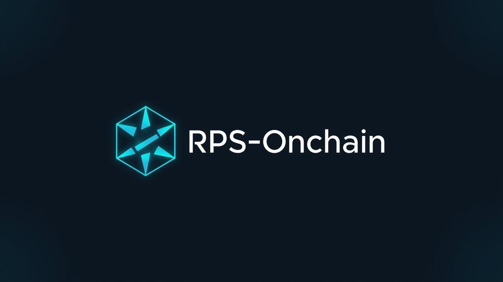

# RPS-ONCHAIN


A decentralized Rock Paper Scissors game with real money betting, human verification, and gaming aesthetics. Built with scaffold-eth-2 on Celo Mainnet.

## Game Features

- **Wallet Authentication**: RainbowKit + Wagmi integration with "Sign In" flow
- **Smart Contract Gameplay**: Commit-reveal scheme prevents cheating
- **Room System**: Create/join rooms with 6-character codes
- **Real Money Betting**: CELO wagering with winner-takes-all payouts
- **Room Cancellation**: Cancel unjoined rooms for full refund
- **Self Protocol Verification**: Human verification unlocks higher betting limits
  - Unverified: 20 CELO max bet
  - Verified: 1000 CELO max bet
- **Match History**: Decentralized storage via IPFS (Pinata) with timestamped filenames
- **Gaming UI**: Neon aesthetics with smooth animations and gradient backgrounds
- **Multi-Room Protection**: Warnings when joining multiple active rooms
- **Divvi Integration**: Referral tracking and rewards on all transactions
- **Edge Config**: Persistent verification storage across devices

## 🏗 Project Structure

```
packages/
├── hardhat/          # Smart contracts & deployment
│   ├── contracts/    # Solidity contracts (RPSOnline.sol)
│   ├── deploy/       # Deployment scripts
│   └── scripts/      # Utility scripts
└── nextjs/           # Frontend application
    ├── app/          # Next.js 13+ app directory
    │   ├── game/     # Game interface pages
    │   ├── history/  # Match history page
    │   ├── play/     # Room creation/joining
    │   └── api/      # Backend API routes
    ├── components/   # React components (Header)
    ├── hooks/        # Custom hooks (useRPSContract)
    ├── lib/          # Storage utilities
    └── utils/        # Game utilities (hashing, moves)
```

## 🚀 Quick Start

### Prerequisites

- Node.js 18+
- Yarn or pnpm

### Installation & Setup

1. **Install dependencies**

   ```bash
   yarn install
   ```

2. **Start local blockchain**

   ```bash
   yarn chain
   ```

   Keep this terminal open - it runs your local Hardhat network.

3. **Deploy contracts** (in a new terminal)

   ```bash
   yarn deploy
   ```

   This deploys the RPSOnline contract to your local network.

4. **Start frontend** (in a new terminal)
   ```bash
   yarn start
   ```
   Frontend runs on `http://localhost:3000`

## 🎯 How to Play

### Current Implementation (On-Chain)

1. **Connect Wallet**: Use any wallet (MetaMask recommended)
2. **Set Username**: Edit username in header
3. **Create Room**: Generate room code with CELO bet amount
4. **Share Code**: Give the room code to your opponent
5. **Join Room**: Enter room code - bet amount auto-populates
6. **Confirm & Join**: Review stake amount and confirm
7. **Auto-Redirect**: Both players automatically enter game room
8. **Commit Move**: Submit encrypted move on-chain
9. **Reveal Move**: Reveal your move to determine winner
10. **Claim Prize**: Winner claims the full pot

### Room Management

- **Cancel Room**: Room creators can cancel unjoined rooms for full refund
- **Multi-Room Warning**: System warns when joining multiple rooms
- **Auto-Population**: Bet amounts automatically fill when joining rooms

### Game Rules

- Rock beats Scissors
- Scissors beats Paper
- Paper beats Rock
- Same moves = Tie (both players get refund)
- Winner takes full pot (2x bet amount)
- Loser loses their bet
- Abandoned rooms can be cancelled by creator for full refund

## 🔧 Development Commands

```bash
# Blockchain
yarn chain          # Start local Hardhat network
yarn deploy         # Deploy contracts to local network
yarn deploy --network celo # Deploy to Celo mainnet

# Frontend
yarn start          # Start Next.js development server
yarn build          # Build for production
yarn lint           # Run ESLint

# Full stack
yarn dev            # Start frontend (same as yarn start)
```

## 📁 Key Files

### Frontend

- `app/page.tsx` - Home page with wallet connect
- `app/play/page.tsx` - Room creation/joining with betting
- `app/game/[roomId]/page.tsx` - Game interface with commit-reveal
- `app/history/page.tsx` - Match history with IPFS links
- `components/Header.tsx` - Navigation with username editing
- `hooks/useRPSContract.ts` - Smart contract interactions

### Smart Contracts

- `contracts/RPSOnline.sol` - Full RPS game with betting, commit-reveal, and cancellation
- `deploy/00_deploy_rps_online.ts` - Deployment script

### API Routes

- `app/api/username/route.ts` - Username management
- `app/api/store-match/route.ts` - IPFS match storage via Pinata
- `app/api/self-callback/route.ts` - Self Protocol verification callback with Edge Config storage

### Utilities & Libraries

- `utils/gameUtils.ts` - Move hashing and game logic
- `lib/pinataStorage.ts` - IPFS storage utilities (Pinata)
- `lib/edgeConfigClient.ts` - Edge Config client for verification persistence
- `contexts/AuthContext.tsx` - Unified authentication context
- `hooks/useSelfProtocol.ts` - Self Protocol integration with QR code generation

## 🌐 Network Configuration

- **Network**: Celo Mainnet
- **Contract Address**: `0xE6D3cb78A795a49E4AF320282d7cD5117931f6B0`
- **RPC Endpoint**: Celo Forno (public RPC)
- **Local Development**: Hardhat network

Contract addresses are auto-exported to `contracts/deployedContracts.ts` after deployment.

## ✨ Recent Updates

- ✅ Self Protocol integration for human verification
- ✅ Gaming UI with neon aesthetics and animations
- ✅ Edge Config for persistent verification storage
- ✅ Pinata IPFS integration with timestamped filenames
- ✅ Divvi referral tracking on all transactions
- ✅ Celo Forno RPC to avoid rate limits
- ✅ Dynamic betting limits based on verification status
- ✅ Forced claim flow before navigation

## 🔮 Future Enhancements

- Tournament brackets with multi-round matches
- Leaderboards & player statistics
- NFT rewards for winners
- Real-time multiplayer lobbies
- Gasless transactions via meta-transactions
- Mobile app development

## 🛠 Technical Stack

- **Frontend**: Next.js 13+, React, TypeScript, TailwindCSS
- **Wallet**: RainbowKit, Wagmi, Viem
- **Blockchain**: Hardhat, Solidity
- **Network**: Celo Mainnet (Forno RPC)
- **Storage**: IPFS via Pinata
- **Persistence**: Vercel Edge Config
- **Identity**: Self Protocol (@selfxyz/core)
- **Referrals**: Divvi SDK
- **Deployment**: Vercel

## 📝 Environment Variables

Create `.env` files in respective packages:

### `packages/hardhat/.env`

```
DEPLOYER_PRIVATE_KEY=your_private_key
```

### `packages/nextjs/.env.local`

```
NEXT_PUBLIC_WALLET_CONNECT_PROJECT_ID=your_project_id
PINATA_JWT=your_pinata_jwt_token
NEXT_PUBLIC_IPFS_GATEWAY=https://gateway.pinata.cloud

# Edge Config (Auto-populated by Vercel)
EDGE_CONFIG=
EDGE_CONFIG_ID=
VERCEL_API_TOKEN=

# Optional: Bypass Self Protocol for testing
NEXT_PUBLIC_BYPASS_SELF_VERIFICATION=false
```

## 🤝 Contributing

1. Fork the repository
2. Create a feature branch
3. Make your changes
4. Test thoroughly
5. Submit a pull request

## 📄 License

MIT License - see LICENSE file for details.

---

**Ready to play?** Run `yarn chain`, `yarn deploy`, `yarn start` and visit `http://localhost:3000`!
