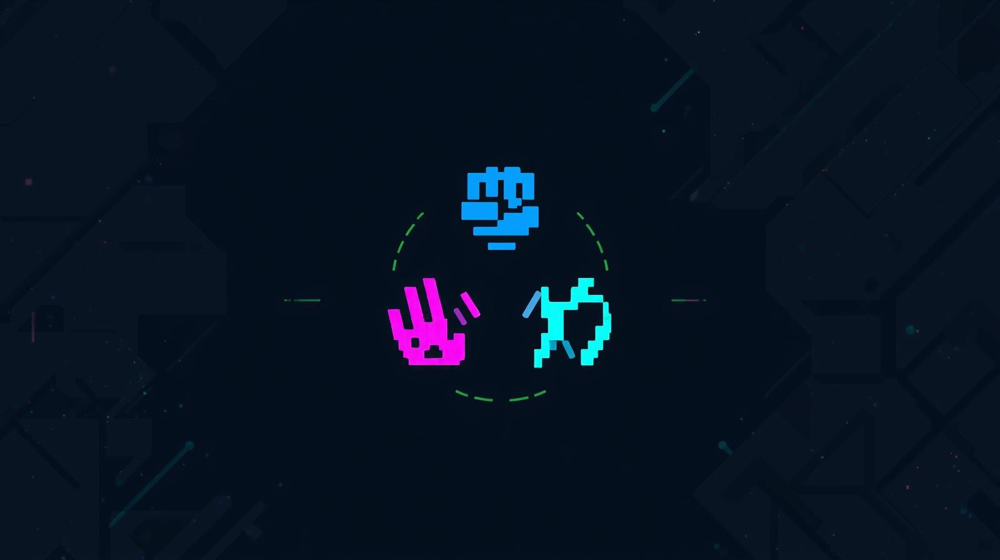

# RPS-onChain


A free-to-play decentralized Rock Paper Scissors game with AI and multiplayer modes. Multi-chain support (Celo + Base). Built with scaffold-eth-2.

## Game Features

- **Wallet Authentication**: RainbowKit + Wagmi integration
- **Free to Play**: No betting, just pure fun
- **Single Player**: Play against AI instantly
- **Multiplayer**: Create/join rooms with 6-character codes
- **Unlimited Rematches**: Play again and again with friends
- **Match History**: Persistent storage via Turso + IPFS backup
- **Blockchain Verification**: Optional on-chain match publishing
- **On-Chain Matches**: View all published matches with filters
- **Gaming UI**: Neon aesthetics with smooth animations
- **Stats Tracking**: Win/loss records stored in Turso database
- **PWA Support**: Install as mobile app with offline capabilities

## 🏗 Project Structure

```
packages/
├── hardhat/          # Smart contracts & deployment
│   ├── contracts/    # Solidity contracts (RPSOnline.sol)
│   ├── deploy/       # Deployment scripts
│   └── scripts/      # Utility scripts
└── nextjs/           # Frontend application
    ├── app/          # Next.js 13+ app directory
    │   ├── game/     # Game interface pages
    │   ├── history/  # Match history page
    │   ├── play/     # Room creation/joining
    │   └── api/      # Backend API routes
    ├── components/   # React components (Header)
    ├── hooks/        # Custom hooks (useRPSContract)
    ├── lib/          # Storage utilities
    └── utils/        # Game utilities (hashing, moves)
```

## 🚀 Quick Start

### Prerequisites

- Node.js 18+
- Yarn or pnpm

### Installation & Setup

1. **Install dependencies**

   ```bash
   yarn install
   ```

2. **Start local blockchain**

   ```bash
   yarn chain
   ```

   Keep this terminal open - it runs your local Hardhat network.

3. **Deploy contracts** (in a new terminal)

   ```bash
   yarn deploy
   ```

   This deploys the RPSOnline contract to your local network.

4. **Start frontend** (in a new terminal)
   ```bash
   yarn start
   ```
   Frontend runs on `http://localhost:3000`

## 🎯 How to Play

### How to Play

1. **Connect Wallet**: Use any wallet (MetaMask recommended)
2. **Choose Mode**: Single Player (AI) or Multiplayer (Free)
3. **Create Room**: Generate 6-character room code
4. **Share Code**: Give the room code to your opponent
5. **Join Room**: Enter room code to join
6. **Choose Move**: Select rock, paper, or scissors
7. **See Results**: Winner determined instantly
8. **Play Again**: Request rematch for unlimited games

### Room Management

- **Cancel Room**: Room creators can cancel unjoined rooms
- **Leave Room**: Exit after game finishes
- **Rematch System**: Request/accept rematches instantly

### Game Rules

- Rock beats Scissors
- Scissors beats Paper
- Paper beats Rock
- Same moves = Tie
- All games are free
- Stats tracked on IPFS
- Unlimited rematches available

## 🔧 Development Commands

```bash
# Blockchain
yarn chain          # Start local Hardhat network
yarn deploy         # Deploy contracts to local network
yarn deploy --network celo # Deploy to Celo mainnet
yarn deploy --network base # Deploy to Base mainnet

# Frontend
yarn start          # Start Next.js development server
yarn build          # Build for production
yarn lint           # Run ESLint

# Full stack
yarn dev            # Start frontend (same as yarn start)
```

## 📁 Key Files

### Frontend

- `app/page.tsx` - Home page with wallet connect
- `app/play/page.tsx` - Room creation/joining with betting
- `app/game/[roomId]/page.tsx` - Game interface with commit-reveal
- `app/history/page.tsx` - Match history with IPFS links
- `components/Header.tsx` - Navigation with username editing
- `hooks/useRPSContract.ts` - Smart contract interactions

### Smart Contracts

- `contracts/RPSOnline.sol` - Full RPS game with betting, commit-reveal, and cancellation
- `deploy/00_deploy_rps_online.ts` - Deployment script

### API Routes

- `app/api/username/route.ts` - Username management
- `app/api/stats-fast/route.ts` - Stats with Turso + Redis cache
- `app/api/store-match/route.ts` - Match storage (Turso + IPFS backup)
- `app/api/user-matches/route.ts` - Query match history from Turso
- `app/api/init-db/route.ts` - Initialize Turso database tables
- `app/api/migrate-data/route.ts` - Migrate Redis data to Turso
- `app/api/store-blockchain-proof/route.ts` - Blockchain proof storage
- `app/api/resolve-name/route.ts` - ENS/Basename resolution
- `app/api/verify/route.ts` - Self Protocol verification
- `app/api/check-verification/route.ts` - Check user verification status

### Utilities & Libraries

- `utils/gameUtils.ts` - Move hashing and game logic
- `lib/tursoStorage.ts` - Turso storage layer (users, stats, matches)
- `lib/turso.ts` - Turso SQLite database client
- `lib/pinataStorage.ts` - IPFS storage utilities (Pinata)
- `lib/upstash.ts` - Redis client for caching
- `lib/edgeConfigClient.ts` - Edge Config client
- `contexts/AuthContext.tsx` - Unified authentication context
- `hooks/useSelfProtocol.ts` - Self Protocol integration
- `engine/` - Game engine (StateManager, NetworkSync, GameEngine)
- `stores/` - Zustand state management (gameStore, userStore)

## 🌐 Network Configuration

### **Supported Networks**

**Celo Mainnet:**

- Contract: `0xace7999ca29Fc9d3dfDD8D7F99A1366a5cF62091`
- RPC: https://forno.celo.org
- Gas Token: CELO or cUSD
- Recommended Wallets: MiniPay, MetaMask

**Base Mainnet:**

- Contract: `0x17f238a671CEEa5b6ac9b44E280a42a2Bb080feC`
- RPC: https://mainnet.base.org
- Gas Token: ETH
- Recommended Wallets: Coinbase Wallet, MetaMask

**Local Development:**

- Hardhat network (localhost)

Contract addresses are auto-exported to `contracts/deployedContracts.ts` after deployment.

## ✨ Recent Updates

- ✅ Pivoted to free-to-play model
- ✅ Removed all betting/paid room functionality
- ✅ Gaming UI with neon aesthetics and animations
- ✅ Migrated to Turso as primary database (stats, matches, users)
- ✅ Redis caching layer for fast reads (5min TTL)
- ✅ IPFS backup storage via Pinata
- ✅ PWA support with offline capabilities
- ✅ Game engine architecture with state management
- ✅ Zustand global state stores
- ✅ Unlimited rematch system
- ✅ On-chain matches page with filters
- ✅ Per-match publishing with ENS/Basename resolution
- ✅ Performance optimizations (84% faster load, 60 FPS locked)

## 🔮 Future Enhancements

- Tournament brackets with multi-round matches
- Global leaderboards & player statistics
- Achievement system
- Real-time multiplayer lobbies
- Mobile app development
- Optional betting mode (future)

## 🛠 Technical Stack

- **Frontend**: Next.js 15, React 18, TypeScript, TailwindCSS
- **Wallet**: RainbowKit, Wagmi, Viem
- **Blockchain**: Hardhat, Solidity
- **Networks**: Celo Mainnet + Base Mainnet (Multi-chain)
- **Database**: Turso SQLite (primary), Redis (cache), IPFS (backup)
- **State Management**: Zustand with localStorage persistence
- **Testing**: Vitest + React Testing Library
- **Identity**: Self Protocol (@selfxyz/core)
- **Payments**: GoodDollar (G$) tipping
- **PWA**: Service Worker with offline support
- **Deployment**: Vercel

## 📝 Environment Variables

Create `.env` files in respective packages:

### `packages/hardhat/.env`

```
DEPLOYER_PRIVATE_KEY=your_private_key
```

### `packages/nextjs/.env.local`

```
NEXT_PUBLIC_WALLET_CONNECT_PROJECT_ID=your_project_id

# Turso Database (primary storage)
TURSO_DATABASE_URL=libsql://your-database.turso.io
TURSO_AUTH_TOKEN=your_turso_auth_token

# Redis (caching layer)
REDIS_URL=your_redis_url
KV_URL=your_kv_url
KV_REST_API_TOKEN=your_token
KV_REST_API_URL=your_url

# IPFS (backup storage)
PINATA_JWT=your_pinata_jwt_token
NEXT_PUBLIC_IPFS_GATEWAY=https://gateway.pinata.cloud

# Edge Config (verification storage)
EDGE_CONFIG=https://edge-config.vercel.com/...
EDGE_CONFIG_ID=ecfg_...
VERCEL_API_TOKEN=...

# Optional
NEYNAR_API_KEY=your_neynar_key
JWT_SECRET=your_jwt_secret
```

## 🗄️ Database Setup

### First-Time Setup

After deploying to production:

1. **Initialize Turso tables**:
   ```bash
   curl https://your-domain.com/api/init-db
   ```

2. **Migrate existing data** (if upgrading from Redis-only):
   ```bash
   curl -X POST https://your-domain.com/api/migrate-data
   ```

### Database Architecture

- **Turso (Primary)**: Users, stats, matches - persistent, ACID-compliant
- **Redis (Cache)**: 5min TTL for stats, active game rooms
- **IPFS (Backup)**: Decentralized match storage

## 🤝 Contributing

1. Fork the repository
2. Create a feature branch
3. Make your changes
4. Test thoroughly
5. Submit a pull request

## 📄 License

MIT License - see LICENSE file for details.

---

**Ready to play?** Run `yarn chain`, `yarn deploy`, `yarn start` and visit `http://localhost:3000`!
